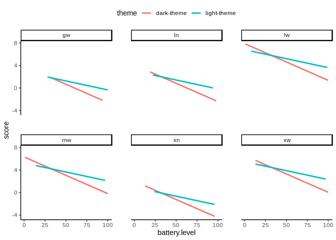

Večnivojsko Hiearhično Modeliranje
================

``` r
library('lme4')
```

    ## Loading required package: Matrix

``` r
library('lmerTest')
```

    ## 
    ## Attaching package: 'lmerTest'

    ## The following object is masked from 'package:lme4':
    ## 
    ##     lmer

    ## The following object is masked from 'package:stats':
    ## 
    ##     step

``` r
library('ggplot2')
```

``` r
df <- read.csv('data.csv', header=TRUE)
```

Večnivojsko modeliranje je predvsem primerno pri raziskavah, kjer lahko
podatke grupiramo po določeni spremenljivki in gre za generalizacijo
linearne regresije. Poznamo več vrst različnih modelov: <br />

#### Random intercept model

Predstavlja modele, kjer dovolimo, da se intercepti oz. začetne
vrednosti regresijskih premic spreminjajo. Ta model predpostavlja, da so
koeficienti premic enaki. Z njim si lahko pomagamo pri računanju ICC oz.
intraclass correlation koeficientu, ki pove ali je večnivojsko
modeliranje potrebno (tipično vrednosti nad 0.05 nakazujejo, da je
večnivojsko modeliranje primerno).

#### Random slopes model

Predstavlja modele, kjer se koeficienti lahko spreminjajo znotraj
različnih grup oz. skupin. Ta model predpostavlja, da so začetne
vrednosti premic enake.

#### Random intercept and slopes model

Najbolj realističen model, ki vsebuje različne začetne vrednosti kot
tudi koeficiente premic v različnih skupinah in je najbolj kompleksen.

Pri sami izgradnji modelov ni tako pomembno število vnosov znotraj
posamezne skupine. Bolj je pomembno je število različnih skupin, ki
znaša minimalno 5.

V našem primeru je najbolj smiselno podatke grupirati po spremenljivki
`str_lay_i`. Pri deskriptivni analizi smo namreč opazili, da na kakovost
prikaza novic najbolj vpliva izbira določenega pogleda (spremenljivka
`layout`) in prisotnost slik (spremenljivka `images`). Spremenljivka
`str_lay_i` pa predstavlja niz znakov, doližnine dva (`layout` +
`images`), ki pove informacije o trenutem pogledu in ali so slike
pristone. Možne vrednosti spremenljivke `str_lay_i` so torej sledeče:

<ul>

<li>

gw - `gridView` + `withImages`

</li>

<li>

ln - `largeCards` + `noImages`

</li>

<li>

lw - `largeCards` + `withImages`

</li>

<li>

mw - `miniCards` + `withImages`

</li>

<li>

xn - `xLargeCards` + `noImages`

</li>

<li>

xw - `xLargeCards` + `withImages`

</li>

</ul>

Gradnjo modelov bomo začeli pri manj kompleksnih modelih, ki imajo manj
parametrov postoma pa bomo dodajali nove. Gradili bomo tako, da bodo čim
bolj jasno predstavljene smiselne interakcije. Zgrajene modele bomo
primerjali s pomočjo funkcije `anova`. Najboljši model bomo potem
primerjali še z ostalimi (Random forest, Bayesov klasifikator,
odločitveno drevo, AdaBoost).

### Izgradnja večnivojskega modela

Začeli bomo torej s t.i. `random intercept modelom`, ki nam bo povedal,
ali je smiselno izvajati večnivojsko modeliranje. V našem primeru smo
opazili, da večnivojsko modeliranje je smiselno, saj vrednost ICC znaša
5.611 / (5.611 + 12.385) = 0.312, kar pomeni, da lahko nadaljujemo z
večnivojskim modeliranjem, saj do 31% variance prihaja na podlagi
izbire pogleda in prisotnosti slik (spremenljivka `str_lay_i`).

Iz izpisa funkcije `summary` lahko sklepamo, da povprečna vrednost ocen
pogledov znaša 1.4349 (vrednost spremenljivke `(Intercept)`).

Na podlagi izpisa funkcije `coefficients` pa opazimo, da imajo pogledi s
slikami v splošnem višje ocene, kot tisti brez. To je tudi pričakovano,
saj prikazi novic brez slik niso tipični. V današnjih aplikacijah ali
spletnih straneh redko beremo novice brez slik, saj te dodajo estetsko
vrednost aplikaciji hkrati pa lahko več povejo o novici kot zgolj le
besedilo in so v splošnem ljudem bolj zanimive od samega besedila.

Prav tako opazimo negativne vrednosti pri spremenljivki `xn`
(`xLargeCards + noImages`), saj tak način prikaza ni standarden. Po
aplikaciji navigiramo s premiki levo-desno in ne z navigacijo gor-dol.
Na zaslonu lahko vidimo torej le eno novico, saj se uporabnik lahko tako
lažje osredotoči na samo novico. V primeru ko slik torej ni, je na
zaslonu podanih premalo informacij (le besedilo). Tako si lahko
razložimo, zakaj ima prikaz `largeCards` višje ocene od prikaza
`xLargeCards`, ko slik ni, saj ima uporabnik na voljo več informacij,
ker je prikazanih več novic hkrati.

Vrednost 0.003151307 pri spremenljivki `gw` (`gridView + withImages`)
prav tako ni presenetljiva, saj uporabniku ponuja premalo informacij na
zaslonu, ker ima na voljo le slike s kratkim besedilom o novici. To
lahko sklepamo na podlagi tega, da vrednost `mw` (`miniCards +
withImages`) ima v povprečju višje ocene.

``` r
null.model <- lmer(score ~ 1 + (1|str_lay_i), data=df)
summary(null.model)
```

    ## Linear mixed model fit by REML. t-tests use Satterthwaite's method [
    ## lmerModLmerTest]
    ## Formula: score ~ 1 + (1 | str_lay_i)
    ##    Data: df
    ## 
    ## REML criterion at convergence: 4497.4
    ## 
    ## Scaled residuals: 
    ##     Min      1Q  Median      3Q     Max 
    ## -3.0152 -0.4579  0.3038  0.5879  2.2139 
    ## 
    ## Random effects:
    ##  Groups    Name        Variance Std.Dev.
    ##  str_lay_i (Intercept)  5.611   2.369   
    ##  Residual              12.385   3.519   
    ## Number of obs: 836, groups:  str_lay_i, 6
    ## 
    ## Fixed effects:
    ##             Estimate Std. Error     df t value Pr(>|t|)
    ## (Intercept)   1.4349     0.9777 5.0271   1.468    0.202

``` r
coefficients(null.model)
```

    ## $str_lay_i
    ##     (Intercept)
    ## gw  0.003151307
    ## ln  0.275125959
    ## lw  4.611445404
    ## mw  2.580268579
    ## xn -1.791197939
    ## xw  2.930906540
    ## 
    ## attr(,"class")
    ## [1] "coef.mer"

V nadaljevanju si bomo pogledali, kako posamezne spremenljivke na prvem
nivoju vplivajo na končno oceno uporabnika. Nato bomo poskušali dodajati
interakcije med spremenljivkami

#### Vpliv spremenljivke `user.activity`

Na podlagi spodnjega izpisa lahko vidimo, da v povprečju najslabše ocene
dobivajo prikazi novic, ko se uporabnik vozi (vrednost `(Inercept)`
znaša -2.3775). Nato pa ocene rastejo, ko se uporabnik sprehaja
(vrednost `user.activityON_FOOT` 3.3328) , ko pa je uporabnik pri miru
pa daje najvišje ocene (vrednost `user.activitySTILL` 5.2966).

Ta pojav si lahko razložimo tako, da je uporabnik slabše osredotočen na
novice, saj ga bolj zanima dogajanje v okolici in si težje nastavi
primeren pogled, ki bi mu lahko podal dovolj
informacij.

``` r
user_activity.model <- lmer(score ~ 1 + user.activity + (1|str_lay_i), data=df)
anova(null.model, user_activity.model) # fizicno aktivnost uporabnika moramo upostevati
```

    ## refitting model(s) with ML (instead of REML)

    ## Data: df
    ## Models:
    ## null.model: score ~ 1 + (1 | str_lay_i)
    ## user_activity.model: score ~ 1 + user.activity + (1 | str_lay_i)
    ##                     npar    AIC    BIC  logLik deviance Chisq Df Pr(>Chisq)    
    ## null.model             3 4505.1 4519.3 -2249.6   4499.1                        
    ## user_activity.model    5 4248.0 4271.6 -2119.0   4238.0 261.1  2  < 2.2e-16 ***
    ## ---
    ## Signif. codes:  0 '***' 0.001 '**' 0.01 '*' 0.05 '.' 0.1 ' ' 1

``` r
summary(user_activity.model)
```

    ## Linear mixed model fit by REML. t-tests use Satterthwaite's method [
    ## lmerModLmerTest]
    ## Formula: score ~ 1 + user.activity + (1 | str_lay_i)
    ##    Data: df
    ## 
    ## REML criterion at convergence: 4238.1
    ## 
    ## Scaled residuals: 
    ##     Min      1Q  Median      3Q     Max 
    ## -3.6891 -0.3885  0.2775  0.6062  3.0725 
    ## 
    ## Random effects:
    ##  Groups    Name        Variance Std.Dev.
    ##  str_lay_i (Intercept) 3.377    1.838   
    ##  Residual              9.097    3.016   
    ## Number of obs: 836, groups:  str_lay_i, 6
    ## 
    ## Fixed effects:
    ##                      Estimate Std. Error       df t value Pr(>|t|)    
    ## (Intercept)           -2.3775     0.7966   6.0390  -2.985   0.0243 *  
    ## user.activityON_FOOT   3.3328     0.3635 828.9871   9.168   <2e-16 ***
    ## user.activitySTILL     5.2966     0.3082 830.1711  17.187   <2e-16 ***
    ## ---
    ## Signif. codes:  0 '***' 0.001 '**' 0.01 '*' 0.05 '.' 0.1 ' ' 1
    ## 
    ## Correlation of Fixed Effects:
    ##             (Intr) u.ON_F
    ## usr.ON_FOOT -0.244       
    ## usr.ctSTILL -0.291  0.669

#### Vpliv spremenljivke `font.size`

Iz spodnjega modela lahko ugotovimo vpliv velikosti pisave na oceno
uporabnika. Opazimo, da je v splošnem ocena manjša, ko ima uporabnik
manjšo pisavo (vrednost spremenljivke `font.sizesmall-font` znaša
-1.0398). To si lahko razložimo, s tem da je velika pisava bolj razločna
in pregledna, saj uporabnik lahko z manj truda prebere novice. Hkrati pa
vrednost ni veliko manjša koeficient znaša namreč le -1.0398. V
nadaljevanju bomo skušali ugotoviti ali morda fizična aktivnost
uporabnika vpliva na izbiro pisave (ko uporabnik hodi je smiselno imeti
večjo pisavo medtem ko je pri miru pa ima lahko tudi manjšo, saj se
lahko tako lažje osredotoči na aplikacijo).

``` r
font_size.model <- lmer(score ~ 1 + font.size + (1|str_lay_i), data=df)
anova(null.model, font_size.model) # velikost pisave moramo upostevati
```

    ## refitting model(s) with ML (instead of REML)

    ## Data: df
    ## Models:
    ## null.model: score ~ 1 + (1 | str_lay_i)
    ## font_size.model: score ~ 1 + font.size + (1 | str_lay_i)
    ##                 npar    AIC    BIC  logLik deviance  Chisq Df Pr(>Chisq)    
    ## null.model         3 4505.1 4519.3 -2249.6   4499.1                         
    ## font_size.model    4 4490.1 4509.0 -2241.0   4482.1 17.009  1  3.721e-05 ***
    ## ---
    ## Signif. codes:  0 '***' 0.001 '**' 0.01 '*' 0.05 '.' 0.1 ' ' 1

``` r
summary(font_size.model)
```

    ## Linear mixed model fit by REML. t-tests use Satterthwaite's method [
    ## lmerModLmerTest]
    ## Formula: score ~ 1 + font.size + (1 | str_lay_i)
    ##    Data: df
    ## 
    ## REML criterion at convergence: 4481.4
    ## 
    ## Scaled residuals: 
    ##     Min      1Q  Median      3Q     Max 
    ## -3.1843 -0.5052  0.2575  0.5789  2.3744 
    ## 
    ## Random effects:
    ##  Groups    Name        Variance Std.Dev.
    ##  str_lay_i (Intercept)  5.135   2.266   
    ##  Residual              12.156   3.487   
    ## Number of obs: 836, groups:  str_lay_i, 6
    ## 
    ## Fixed effects:
    ##                     Estimate Std. Error       df t value Pr(>|t|)    
    ## (Intercept)           2.0212     0.9466   5.2589   2.135   0.0831 .  
    ## font.sizesmall-font  -1.0398     0.2516 832.7682  -4.133 3.94e-05 ***
    ## ---
    ## Signif. codes:  0 '***' 0.001 '**' 0.01 '*' 0.05 '.' 0.1 ' ' 1
    ## 
    ## Correlation of Fixed Effects:
    ##             (Intr)
    ## fnt.szsmll- -0.149

#### Vpliv spremenljivke `internet.speed`

Za spremenljivko `internet.speed` lahko sklepamo, da ima vpliv (na
podlagi modela `internet_speed_effect`). Vrednost ocene uporabnika naj
bi padala, ko hitrost internetne povezave raste, vendar si težko
razložimo zakaj. Potrebno je omeniti tudi, da je zelo malo takih
vnosov, kjer je hitrost internetne povezave enaka 0 (le 45). Prav tako
pa je problematično pridobiti več vnosov, ko ima uporabnik zelo počasno
internetno povezavo, saj danes to ni več problem. V nadaljavanju bomo
pri proučevanju vpliva spremenljivk na končno oceno uporabnika izpustili
spremenljivko
`internet.speed`.

``` r
internet_speed_effect <- lmer(score ~ 1 + internet.speed + (1|str_lay_i), data=df)
summary(internet_speed_effect)
```

    ## Linear mixed model fit by REML. t-tests use Satterthwaite's method [
    ## lmerModLmerTest]
    ## Formula: score ~ 1 + internet.speed + (1 | str_lay_i)
    ##    Data: df
    ## 
    ## REML criterion at convergence: 4272
    ## 
    ## Scaled residuals: 
    ##      Min       1Q   Median       3Q      Max 
    ## -2.87637 -0.58746  0.07792  0.66643  2.45374 
    ## 
    ## Random effects:
    ##  Groups    Name        Variance Std.Dev.
    ##  str_lay_i (Intercept) 4.830    2.198   
    ##  Residual              9.442    3.073   
    ## Number of obs: 836, groups:  str_lay_i, 6
    ## 
    ## Fixed effects:
    ##                Estimate Std. Error       df t value Pr(>|t|)    
    ## (Intercept)      5.7074     0.9439   5.9219   6.047 0.000972 ***
    ## internet.speed  -2.9219     0.1810 829.7661 -16.141  < 2e-16 ***
    ## ---
    ## Signif. codes:  0 '***' 0.001 '**' 0.01 '*' 0.05 '.' 0.1 ' ' 1
    ## 
    ## Correlation of Fixed Effects:
    ##             (Intr)
    ## internt.spd -0.281

#### Vpliv spremenljivke `theme`

Na podlagi klica funkcije `summary` lahko sklepamo, da tema vpliva na
končno oceno uporabnika, p-vrednost pri koeficentu `themelight-theme`
znaša 6.17e-06. Prav tako pa lahko razberemo, da ima v povprečju temna
tema aplikacije nižje ocene od svetle. Vrednost koeficienta
`themelight-theme` je namreč pozitivna in znaša 1.1003, kar pomeni, da
ne glede na to kateri pogled izberemo so ocene višje, ko je nastavljena
svetla tema aplikacije.

``` r
theme_effect <- lmer(score ~ 1 + theme + (1|str_lay_i), data=df)
anova(null.model, theme_effect) # temo moramo upoštevati
```

    ## refitting model(s) with ML (instead of REML)

    ## Data: df
    ## Models:
    ## null.model: score ~ 1 + (1 | str_lay_i)
    ## theme_effect: score ~ 1 + theme + (1 | str_lay_i)
    ##              npar    AIC    BIC  logLik deviance  Chisq Df Pr(>Chisq)    
    ## null.model      3 4505.1 4519.3 -2249.6   4499.1                         
    ## theme_effect    4 4486.6 4505.6 -2239.3   4478.6 20.461  1  6.085e-06 ***
    ## ---
    ## Signif. codes:  0 '***' 0.001 '**' 0.01 '*' 0.05 '.' 0.1 ' ' 1

``` r
summary(theme_effect)
```

    ## Linear mixed model fit by REML. t-tests use Satterthwaite's method [
    ## lmerModLmerTest]
    ## Formula: score ~ 1 + theme + (1 | str_lay_i)
    ##    Data: df
    ## 
    ## REML criterion at convergence: 4477.9
    ## 
    ## Scaled residuals: 
    ##     Min      1Q  Median      3Q     Max 
    ## -2.8973 -0.5260  0.2365  0.6025  2.3913 
    ## 
    ## Random effects:
    ##  Groups    Name        Variance Std.Dev.
    ##  str_lay_i (Intercept)  5.668   2.381   
    ##  Residual              12.097   3.478   
    ## Number of obs: 836, groups:  str_lay_i, 6
    ## 
    ## Fixed effects:
    ##                  Estimate Std. Error       df t value Pr(>|t|)    
    ## (Intercept)        0.9132     0.9890   5.1608   0.923    0.397    
    ## themelight-theme   1.1003     0.2418 829.3494   4.550 6.17e-06 ***
    ## ---
    ## Signif. codes:  0 '***' 0.001 '**' 0.01 '*' 0.05 '.' 0.1 ' ' 1
    ## 
    ## Correlation of Fixed Effects:
    ##             (Intr)
    ## thmlght-thm -0.116

#### Vpliv spremenljivke `time.of.day`

Spodnji model nam pove, da so uporabnikove ocene manjše ob bolj poznih
urah, saj je vrednost koeficienta `time.of.day` negativna in znaša
-0.07844. Razlog za padec ocene bolj kot je pozna ura je lahko ta, da so
uporabniki vedno bolj utrujeni in zato dajejo slabše ocene, saj si težje
prilagodijo izgled aplikacije.

Eden izmed parametrov, ki bi lahko vplival na uro je tema aplikacije.
Sklepali bi lahko, da je svetlost okolice nižja, bolj kot je pozno.
Poslednično pri nižji svetlosti okolice je temna tema aplikacije
primernejša. Povezavo med uro in temo aplikacije bomo proučevali v
razdelku `Kombinacija vpliva spremenljivk theme in time.of.day`.

Prav tako bi bilo zanimivo proučiti povezavo med uro in velikostjo
pisave. Morda bi se lahko izkazalo, da je ob poznejših urah večja pisava
boljša, saj so uporabniki bolj utrujeni. Povezavo bomo raziskali v
razdelku `Kombinacija vpliva spremenljivk font.size in
time.of.day`.

``` r
time_of_day_effect <- lmer(score ~ 1 + time.of.day + (1|str_lay_i), data=df)
anova(null.model, time_of_day_effect) # uro moramo upoštevati
```

    ## refitting model(s) with ML (instead of REML)

    ## Data: df
    ## Models:
    ## null.model: score ~ 1 + (1 | str_lay_i)
    ## time_of_day_effect: score ~ 1 + time.of.day + (1 | str_lay_i)
    ##                    npar    AIC    BIC  logLik deviance Chisq Df Pr(>Chisq)    
    ## null.model            3 4505.1 4519.3 -2249.6   4499.1                        
    ## time_of_day_effect    4 4494.6 4513.5 -2243.3   4486.6 12.53  1  0.0004006 ***
    ## ---
    ## Signif. codes:  0 '***' 0.001 '**' 0.01 '*' 0.05 '.' 0.1 ' ' 1

``` r
summary(time_of_day_effect)
```

    ## Linear mixed model fit by REML. t-tests use Satterthwaite's method [
    ## lmerModLmerTest]
    ## Formula: score ~ 1 + time.of.day + (1 | str_lay_i)
    ##    Data: df
    ## 
    ## REML criterion at convergence: 4490.7
    ## 
    ## Scaled residuals: 
    ##     Min      1Q  Median      3Q     Max 
    ## -3.0903 -0.4533  0.2058  0.6185  2.3695 
    ## 
    ## Random effects:
    ##  Groups    Name        Variance Std.Dev.
    ##  str_lay_i (Intercept)  5.489   2.343   
    ##  Residual              12.216   3.495   
    ## Number of obs: 836, groups:  str_lay_i, 6
    ## 
    ## Fixed effects:
    ##              Estimate Std. Error        df t value Pr(>|t|)    
    ## (Intercept)   2.44205    1.00791   5.92892   2.423  0.05215 .  
    ## time.of.day  -0.07844    0.02211 829.35802  -3.548  0.00041 ***
    ## ---
    ## Signif. codes:  0 '***' 0.001 '**' 0.01 '*' 0.05 '.' 0.1 ' ' 1
    ## 
    ## Correlation of Fixed Effects:
    ##             (Intr)
    ## time.of.day -0.282

#### Vpliv spremenljivke `env.brightness`

Na podlagi spodnjega izpisa, lahko sklepamo, da uporabniki dajejo v
povprečju višje ocene, manjša kot je svetlost okolice. Vrednost
parametra `(Intercept)` znaša 2.5614. Prav tako, ko je svetlost malo
višja (vrednost koeficienta `env.brightnessL2` znaša le 0.6476), dajejo
uporabniki nekoliko boljše ocene, kar je skoraj zanemarljivo. Potem pa
se ocene razlikujejo za višje faktorje (vrednost spremenljivke
`env.brightnessL3` znaša -1.2248 pri spremenljivki `env.brightnessL4` pa
-2.4363), kar pomeni, da ko je svetlost okolice višja, uporabniki dajejo
prikazom slabše ocene.

V povezavi s svetlostjo okolice, bi bilo najbolje proučiti vpliv
spremenljivke `theme`. Sklepali bi namreč lahko, da pri višji svetlosti
okolice svetla tema aplikacije prevladuje medtem ko pri nižji temna
tema, kar bomo preverili v razdelku `Kombinacija vpliva spremenljivk
theme in
env.brightness`.

``` r
env_brightness_effect <- lmer(score ~ 1 + env.brightness + (1|str_lay_i), data=df)
anova(null.model, env_brightness_effect) # svetlost okolice moramo upoštevati
```

    ## refitting model(s) with ML (instead of REML)

    ## Data: df
    ## Models:
    ## null.model: score ~ 1 + (1 | str_lay_i)
    ## env_brightness_effect: score ~ 1 + env.brightness + (1 | str_lay_i)
    ##                       npar    AIC    BIC  logLik deviance  Chisq Df Pr(>Chisq)
    ## null.model               3 4505.1 4519.3 -2249.6   4499.1                     
    ## env_brightness_effect    6 4421.2 4449.6 -2204.6   4409.2 89.912  3  < 2.2e-16
    ##                          
    ## null.model               
    ## env_brightness_effect ***
    ## ---
    ## Signif. codes:  0 '***' 0.001 '**' 0.01 '*' 0.05 '.' 0.1 ' ' 1

``` r
summary(env_brightness_effect)
```

    ## Linear mixed model fit by REML. t-tests use Satterthwaite's method [
    ## lmerModLmerTest]
    ## Formula: score ~ 1 + env.brightness + (1 | str_lay_i)
    ##    Data: df
    ## 
    ## REML criterion at convergence: 4408.6
    ## 
    ## Scaled residuals: 
    ##     Min      1Q  Median      3Q     Max 
    ## -2.7639 -0.5641  0.2281  0.6037  2.6144 
    ## 
    ## Random effects:
    ##  Groups    Name        Variance Std.Dev.
    ##  str_lay_i (Intercept)  4.542   2.131   
    ##  Residual              11.171   3.342   
    ## Number of obs: 836, groups:  str_lay_i, 6
    ## 
    ## Fixed effects:
    ##                  Estimate Std. Error       df t value Pr(>|t|)    
    ## (Intercept)        2.5614     0.8949   5.3408   2.862 0.032751 *  
    ## env.brightnessL2   0.6476     0.4677 827.5660   1.385 0.166523    
    ## env.brightnessL3  -1.2248     0.3555 828.6109  -3.446 0.000599 ***
    ## env.brightnessL4  -2.4363     0.2741 828.8471  -8.889  < 2e-16 ***
    ## ---
    ## Signif. codes:  0 '***' 0.001 '**' 0.01 '*' 0.05 '.' 0.1 ' ' 1
    ## 
    ## Correlation of Fixed Effects:
    ##             (Intr) env.L2 env.L3
    ## env.brghtL2 -0.086              
    ## env.brghtL3 -0.128  0.212       
    ## env.brghtL4 -0.158  0.267  0.391

#### Vpliv spremenljivke `battery.level`

Iz spodnjega modela lahko razberemo, da uporabniki dajejo slabše ocene
višji kot je nivo baterije. Vrednost koeficienta `battery.level` je
negativna in znaša `-0.051929`.

V razdelku `Kombinacija vpliva spremenljivk theme in battery.level` bomo
podrobneje proučili, kako nivo baterije vpliva na temo aplikacije. V
praksi se namreč izkaže, da lahko z uporabo temne barve oz. temne teme
aplikacije porabimo manj
baterije.

``` r
battery_level_effect <- lmer(score ~ 1 + battery.level + (1|str_lay_i), data=df)
anova(null.model, battery_level_effect) # nivo baterije moramo upoštevati
```

    ## refitting model(s) with ML (instead of REML)

    ## Data: df
    ## Models:
    ## null.model: score ~ 1 + (1 | str_lay_i)
    ## battery_level_effect: score ~ 1 + battery.level + (1 | str_lay_i)
    ##                      npar    AIC    BIC  logLik deviance  Chisq Df Pr(>Chisq)
    ## null.model              3 4505.1 4519.3 -2249.6   4499.1                     
    ## battery_level_effect    4 4400.8 4419.7 -2196.4   4392.8 106.28  1  < 2.2e-16
    ##                         
    ## null.model              
    ## battery_level_effect ***
    ## ---
    ## Signif. codes:  0 '***' 0.001 '**' 0.01 '*' 0.05 '.' 0.1 ' ' 1

``` r
summary(battery_level_effect)
```

    ## Linear mixed model fit by REML. t-tests use Satterthwaite's method [
    ## lmerModLmerTest]
    ## Formula: score ~ 1 + battery.level + (1 | str_lay_i)
    ##    Data: df
    ## 
    ## REML criterion at convergence: 4400.1
    ## 
    ## Scaled residuals: 
    ##     Min      1Q  Median      3Q     Max 
    ## -2.9763 -0.5548  0.1803  0.6759  2.7864 
    ## 
    ## Random effects:
    ##  Groups    Name        Variance Std.Dev.
    ##  str_lay_i (Intercept)  4.616   2.148   
    ##  Residual              10.925   3.305   
    ## Number of obs: 836, groups:  str_lay_i, 6
    ## 
    ## Fixed effects:
    ##                 Estimate Std. Error         df t value Pr(>|t|)    
    ## (Intercept)     4.750779   0.940661   6.336651    5.05  0.00199 ** 
    ## battery.level  -0.051929   0.004885 830.045901  -10.63  < 2e-16 ***
    ## ---
    ## Signif. codes:  0 '***' 0.001 '**' 0.01 '*' 0.05 '.' 0.1 ' ' 1
    ## 
    ## Correlation of Fixed Effects:
    ##             (Intr)
    ## battery.lvl -0.331

#### Vpliv spremenljivke `screen.brightness`

Glede na to, da model slabše napoveduje uporabnikovo oceno, od najbolj
osnovnega (`null.model`), bomo v nadaljevanju izpustili spremenljivko
`screen.brightness`. Ta bi lahko imela vpliv na temo aplikacije. Njen
pomen pa lahko nadomestimo s svetlostjo okolice, saj kot bomo videli v
nadaljevanju ima ta velik vpliv na izbiro teme
aplikacije.

``` r
screen_brightness_effect <- lmer(score ~ 1 + screen.brightness + (1|str_lay_i), data=df)
anova(null.model, screen_brightness_effect) # Svetlosti zaslona ni potrebno upoštevati
```

    ## refitting model(s) with ML (instead of REML)

    ## Data: df
    ## Models:
    ## null.model: score ~ 1 + (1 | str_lay_i)
    ## screen_brightness_effect: score ~ 1 + screen.brightness + (1 | str_lay_i)
    ##                          npar    AIC    BIC  logLik deviance  Chisq Df
    ## null.model                  3 4505.1 4519.3 -2249.6   4499.1          
    ## screen_brightness_effect    4 4505.7 4524.6 -2248.8   4497.7 1.3893  1
    ##                          Pr(>Chisq)
    ## null.model                         
    ## screen_brightness_effect     0.2385

``` r
summary(screen_brightness_effect)
```

    ## Linear mixed model fit by REML. t-tests use Satterthwaite's method [
    ## lmerModLmerTest]
    ## Formula: score ~ 1 + screen.brightness + (1 | str_lay_i)
    ##    Data: df
    ## 
    ## REML criterion at convergence: 4506.9
    ## 
    ## Scaled residuals: 
    ##     Min      1Q  Median      3Q     Max 
    ## -3.0850 -0.4475  0.3287  0.6321  2.1746 
    ## 
    ## Random effects:
    ##  Groups    Name        Variance Std.Dev.
    ##  str_lay_i (Intercept)  5.669   2.381   
    ##  Residual              12.379   3.518   
    ## Number of obs: 836, groups:  str_lay_i, 6
    ## 
    ## Fixed effects:
    ##                    Estimate Std. Error        df t value Pr(>|t|)
    ## (Intercept)       1.135e+00  1.015e+00 5.717e+00   1.119    0.308
    ## screen.brightness 2.034e-03  1.720e-03 8.294e+02   1.183    0.237
    ## 
    ## Correlation of Fixed Effects:
    ##             (Intr)
    ## scrn.brghtn -0.250

#### Kombinacija vpliva spremenljivk `theme` in `time.of.day`

Kot smo omenili si bomo na tem mestu pogledali ali obstaja povezava med
temo aplikacije in uro. Iz spodnjih dveh modelov lahko ugotovimo, da
interakcije med temo aplikacije in uro ni potrebno upoštevati, saj je
model, ki jih upošteva slabši. Sklepamo pa lahko iz spodnjega modela, da
je v splošnem svetla tema aplikacije boljša od temne, saj je vrednost
koeficienta `themelight-theme` pozitivna in znaša 1.27837. Prav tako pa
kot iz prejšnega modela (`time_of_day_effect`), ki pri napovedovanju
uporabnikove ocene upošteva le uro, pridemo do istega sklepa. Bolj kot
je pozna ura uporabniki dajejo prikazom novic slabše ocene. Vrednost
koeficienta `time.of.day` je namreč negativna in znaša
-0.09772.

``` r
# najprej poskusimo, če sploh obstaja interakcija med temo aplikacijo in uro
# to lahko storimo s spodnjima modeloma
time_of_day_theme_no_inter <- lmer(score ~ 1 + theme + time.of.day + (1|str_lay_i), data=df)
time_od_day_theme_with_inter <- lmer(score ~ 1 + theme*time.of.day + (1|str_lay_i), data=df)

# na podlagi spodnje funkcije ugotovimo, da ni potrebno upoštevati interakcije (vrednosti
# AIC in BIC so se namreč povečale, prav tako pa ni statistično relevantne razlike med modeloma
# p vrednost znaša 0.4861) 
# analizirali bomo model brez upoštevanja interakcij
anova(time_of_day_theme_no_inter, time_od_day_theme_with_inter)
```

    ## refitting model(s) with ML (instead of REML)

    ## Data: df
    ## Models:
    ## time_of_day_theme_no_inter: score ~ 1 + theme + time.of.day + (1 | str_lay_i)
    ## time_od_day_theme_with_inter: score ~ 1 + theme * time.of.day + (1 | str_lay_i)
    ##                              npar    AIC    BIC  logLik deviance  Chisq Df
    ## time_of_day_theme_no_inter      5 4469.2 4492.8 -2229.6   4459.2          
    ## time_od_day_theme_with_inter    6 4470.7 4499.1 -2229.3   4458.7 0.4851  1
    ##                              Pr(>Chisq)
    ## time_of_day_theme_no_inter             
    ## time_od_day_theme_with_inter     0.4861

``` r
summary(time_of_day_theme_no_inter)
```

    ## Linear mixed model fit by REML. t-tests use Satterthwaite's method [
    ## lmerModLmerTest]
    ## Formula: score ~ 1 + theme + time.of.day + (1 | str_lay_i)
    ##    Data: df
    ## 
    ## REML criterion at convergence: 4464.3
    ## 
    ## Scaled residuals: 
    ##     Min      1Q  Median      3Q     Max 
    ## -2.9729 -0.5316  0.2290  0.6307  2.5067 
    ## 
    ## Random effects:
    ##  Groups    Name        Variance Std.Dev.
    ##  str_lay_i (Intercept)  5.523   2.35    
    ##  Residual              11.834   3.44    
    ## Number of obs: 836, groups:  str_lay_i, 6
    ## 
    ## Fixed effects:
    ##                   Estimate Std. Error        df t value Pr(>|t|)    
    ## (Intercept)        2.08329    1.01143   5.94344   2.060   0.0855 .  
    ## themelight-theme   1.27837    0.24253 828.31564   5.271 1.73e-07 ***
    ## time.of.day       -0.09772    0.02207 828.30778  -4.428 1.08e-05 ***
    ## ---
    ## Signif. codes:  0 '***' 0.001 '**' 0.01 '*' 0.05 '.' 0.1 ' ' 1
    ## 
    ## Correlation of Fixed Effects:
    ##             (Intr) thmlg-
    ## thmlght-thm -0.067       
    ## time.of.day -0.261 -0.166

#### Kombinacija vpliva spremenljivk `theme` in `env.brightness`

Na podlagi spodnjih dveh modelov in klica funkcije anova lahko sklepamo,
da moramo upoštevati interakcijo med temo aplikacijo in svetlostjo
okolice. Vrednosti `AIC` in `BIC` so manjše pri modelu, ki interakcije
med omenjenima spremenljivkama upošteva. Prav tako pa p-vrednost, ki
znaša 4.1e-14, nakazuje na statistično relevantno razliko med modeloma.

Če podrobneje analiziramo torej model, ki interakcije upošteva, pridemo
do naslednjih sklepov:

<ul>

<li>

V splošnem ima temna tema aplikacije višje ocene, saj je vrednost
parametra `themelight-theme` negativna in znaša -0.3574. Na podlagi
njegove p-vrednosti, ki znaša 0.3113 pa lahko sklepamo, da je razlika
relativno majhna.

</li>

<li>

Še vedno velja, da uporabniki dajejo slabše ocene, ko je svetlost
okolice višja, saj so vrednosti parametrov `env.brightnessL3` in
`env.brightnessL4` negativne.

</li>

<li>

Ne smemo pa zanemariti dejstva da z rastjo svetlosti okolice rastejo
tudi ocene za svetlo temo aplikacije. To lahko sklepamo na podlagi
vrednosti koeficientov `themelight-theme:env.brightnessL3` in
`themelight-theme:env.brightnessL4`, ki so vedno višji.

</li>

</ul>

Glavna ugotovitev je, da temna tema aplikacije pridobiva boljše ocene,
ko je svetlost okolice nižja, medtem ko priljubljenost svetle teme
aplikacije raste, ko raste tudi svetlost
okolice.

``` r
env_brightness_theme_no_inter <- lmer(score ~ 1 + theme + env.brightness + (1|str_lay_i), data=df)
env_brightness_theme_with_inter <- lmer(score ~ 1 + theme*env.brightness + (1|str_lay_i), data=df)
anova(env_brightness_theme_no_inter, env_brightness_theme_with_inter)
```

    ## refitting model(s) with ML (instead of REML)

    ## Data: df
    ## Models:
    ## env_brightness_theme_no_inter: score ~ 1 + theme + env.brightness + (1 | str_lay_i)
    ## env_brightness_theme_with_inter: score ~ 1 + theme * env.brightness + (1 | str_lay_i)
    ##                                 npar    AIC    BIC  logLik deviance  Chisq Df
    ## env_brightness_theme_no_inter      7 4389.7 4422.8 -2187.9   4375.7          
    ## env_brightness_theme_with_inter   10 4330.3 4377.6 -2155.2   4310.3 65.409  3
    ##                                 Pr(>Chisq)    
    ## env_brightness_theme_no_inter                 
    ## env_brightness_theme_with_inter    4.1e-14 ***
    ## ---
    ## Signif. codes:  0 '***' 0.001 '**' 0.01 '*' 0.05 '.' 0.1 ' ' 1

``` r
summary(env_brightness_theme_with_inter)
```

    ## Linear mixed model fit by REML. t-tests use Satterthwaite's method [
    ## lmerModLmerTest]
    ## Formula: score ~ 1 + theme * env.brightness + (1 | str_lay_i)
    ##    Data: df
    ## 
    ## REML criterion at convergence: 4308.4
    ## 
    ## Scaled residuals: 
    ##     Min      1Q  Median      3Q     Max 
    ## -2.9845 -0.4824  0.2355  0.5497  3.3262 
    ## 
    ## Random effects:
    ##  Groups    Name        Variance Std.Dev.
    ##  str_lay_i (Intercept) 4.070    2.018   
    ##  Residual              9.973    3.158   
    ## Number of obs: 836, groups:  str_lay_i, 6
    ## 
    ## Fixed effects:
    ##                                   Estimate Std. Error       df t value Pr(>|t|)
    ## (Intercept)                         2.8106     0.8585   5.6222   3.274   0.0186
    ## themelight-theme                   -0.3574     0.3527 823.5219  -1.013   0.3113
    ## env.brightnessL2                    0.5106     0.7441 823.6698   0.686   0.4928
    ## env.brightnessL3                   -1.8367     0.4649 825.1462  -3.951 8.46e-05
    ## env.brightnessL4                   -4.5814     0.3537 824.8032 -12.951  < 2e-16
    ## themelight-theme:env.brightnessL2   0.2823     0.9360 823.5091   0.302   0.7630
    ## themelight-theme:env.brightnessL3   1.1616     0.6664 823.9114   1.743   0.0817
    ## themelight-theme:env.brightnessL4   4.0599     0.5126 823.8412   7.920 7.67e-15
    ##                                      
    ## (Intercept)                       *  
    ## themelight-theme                     
    ## env.brightnessL2                     
    ## env.brightnessL3                  ***
    ## env.brightnessL4                  ***
    ## themelight-theme:env.brightnessL2    
    ## themelight-theme:env.brightnessL3 .  
    ## themelight-theme:env.brightnessL4 ***
    ## ---
    ## Signif. codes:  0 '***' 0.001 '**' 0.01 '*' 0.05 '.' 0.1 ' ' 1
    ## 
    ## Correlation of Fixed Effects:
    ##             (Intr) thmlg- env.L2 env.L3 env.L4 t-:.L2 t-:.L3
    ## thmlght-thm -0.162                                          
    ## env.brghtL2 -0.080  0.183                                   
    ## env.brghtL3 -0.143  0.289  0.146                            
    ## env.brghtL4 -0.183  0.384  0.197  0.338                     
    ## thmlgh-:.L2  0.061 -0.379 -0.794 -0.108 -0.154              
    ## thmlgh-:.L3  0.092 -0.526 -0.099 -0.686 -0.220  0.196       
    ## thmlgh-:.L4  0.121 -0.696 -0.135 -0.210 -0.671  0.268  0.366

#### Kombinacija vpliva spremenljivk `theme` in `battery.level`

Iz spodnjih dveh modelov lahko sklepamo, da je potrebno upoštevati
interakcijo med temo aplikacije in nivojem baterije. Model, ki jih
upošteva je na podlagi klica funkcije `anova` boljši, saj ima manjše
vrednosti ocen `AIC` in `BIC`, prav tako pa p-vrednost znaša 0.0005406,
kar nakazuje na statistično relevantne razlike med modeloma.

Podrobnejša analiza modela, ki upošteva interakcije nas pripelje do
naslednjih sklepov:

<ul>

<li>

V splošnem je temna tema aplikacije bolj priljubljena, kar lahko
sklepamo na podlagi negativne vrednosti koeficinenta `themelight-theme`,
ampak je ta zelo majhna, saj njegova p-vrednost znaša 0.085772.

</li>

<li>

Na podlagi koeficienta `battery.level` lahko sklepamo, da ocena pogledov
pada, ko se nivo baterije veča

</li>

<li>

Ne smemo pa pozabiti, da je vrednost koeficienta
`themelight-theme:battery.level` pozitivna in na podlagi p-vrednosti ni
zanemarljiva. To pomeni, da z višanjem nivoja baterije pridobivajo
boljše ocene pogledi, ki imajo nastavljeno svetlo temo aplikacije.

</li>

</ul>

To pomeni, da so enačbe premic, ki napovedujejo oceno uporabnika
pridobljene na sledeč način:

<ul>

<li>

Za temno temo aplikacijo velja: 5.124964 + nivo\_baterije\*(-0.065103)

</li>

<li>

Za svetlo temo aplikacije pa: 5.124964 - 1.076953 +
nivo\_baterije*(-0.065103) + nivo\_baterije*0.033259

</li>

</ul>

Če opazujemo zgornji dve enačbi, lahko vidimo, da svetla tema aplikacije
začne dobivati večje ali enake vrednosti ocen, ko vrednost
nivo\_baterije\*0.033259 preraste vrednost 1.076953.

To nas pripelje do naslednje enačbe: 1.076953 = x\*0.033259 =\> x =
1.076953/0.033259 = 32.3808. Kar pomeni, da svetla tema aplikacije začne
dobivati boljše ocene, ko ima uporabnik približno več kot 30% baterije,
kar je razvideno tudi iz spodnjih grafov.

Končni sklep je torej, da moramo upoštevati interakcije med nivojem
baterije in temo aplikacije, saj tako model boljše napoveduje končne
ocene uporabnika. Temna tema aplikacije je boljša, ko je nivo baterije
nižji, saj tako lahko uporabniki podaljšajo življensko dobo baterije. Z
višjim nivojem baterije (približno nad 30%) pa postane svetlejša tema
aplikacije bolj
priljubljena.

``` r
battery_level_theme_no_inter <- lmer(score ~ 1 + theme + battery.level + (1|str_lay_i), data=df)
battery_level_theme_with_inter <- lmer(score ~ 1 + theme*battery.level + (1|str_lay_i), data=df)
anova(battery_level_theme_no_inter, battery_level_theme_with_inter)
```

    ## refitting model(s) with ML (instead of REML)

    ## Data: df
    ## Models:
    ## battery_level_theme_no_inter: score ~ 1 + theme + battery.level + (1 | str_lay_i)
    ## battery_level_theme_with_inter: score ~ 1 + theme * battery.level + (1 | str_lay_i)
    ##                                npar    AIC    BIC  logLik deviance Chisq Df
    ## battery_level_theme_no_inter      5 4385.7 4409.4 -2187.9   4375.7         
    ## battery_level_theme_with_inter    6 4375.8 4404.1 -2181.9   4363.8 11.97  1
    ##                                Pr(>Chisq)    
    ## battery_level_theme_no_inter                 
    ## battery_level_theme_with_inter  0.0005406 ***
    ## ---
    ## Signif. codes:  0 '***' 0.001 '**' 0.01 '*' 0.05 '.' 0.1 ' ' 1

``` r
summary(battery_level_theme_with_inter)
```

    ## Linear mixed model fit by REML. t-tests use Satterthwaite's method [
    ## lmerModLmerTest]
    ## Formula: score ~ 1 + theme * battery.level + (1 | str_lay_i)
    ##    Data: df
    ## 
    ## REML criterion at convergence: 4379.7
    ## 
    ## Scaled residuals: 
    ##     Min      1Q  Median      3Q     Max 
    ## -2.8430 -0.5761  0.1818  0.6708  2.7663 
    ## 
    ## Random effects:
    ##  Groups    Name        Variance Std.Dev.
    ##  str_lay_i (Intercept)  4.742   2.178   
    ##  Residual              10.573   3.252   
    ## Number of obs: 836, groups:  str_lay_i, 6
    ## 
    ## Fixed effects:
    ##                                  Estimate Std. Error         df t value
    ## (Intercept)                      5.124964   0.993355   7.476114   5.159
    ## themelight-theme                -1.076953   0.626067 827.225470  -1.720
    ## battery.level                   -0.065103   0.006374 827.635836 -10.214
    ## themelight-theme:battery.level   0.033259   0.009590 827.339953   3.468
    ##                                Pr(>|t|)    
    ## (Intercept)                    0.001069 ** 
    ## themelight-theme               0.085772 .  
    ## battery.level                   < 2e-16 ***
    ## themelight-theme:battery.level 0.000551 ***
    ## ---
    ## Signif. codes:  0 '***' 0.001 '**' 0.01 '*' 0.05 '.' 0.1 ' ' 1
    ## 
    ## Correlation of Fixed Effects:
    ##             (Intr) thmlg- bttry.
    ## thmlght-thm -0.292              
    ## battery.lvl -0.412  0.628       
    ## thmlght-t:.  0.263 -0.932 -0.655

``` r
(mm_plot <- ggplot(df, aes(x = battery.level, y = score, colour = theme)) +
    facet_wrap(~str_lay_i, nrow=2) +   # a panel for layout_images
    theme_classic() +
    geom_line(data = cbind(df, pred = predict(battery_level_theme_with_inter)), aes(y = pred), size = 1) +  # adding predicted line from mixed model 
    theme(legend.position = "top",
          panel.spacing = unit(2, "lines"))  # adding space between panels
)
```

<!-- -->

#### Kombinacija vpliva spremenljivk `font.size` in `time.of.day`

Na podlagi spodnjih modelov lahko sklepamo, da nam ni potrebno
upoštevati interakcije med velikostjo pisave in uro. Model, ki
omenjenih interakcij ne upošteva ima višje `AIC` in `BIC` vrednosti.
Prav tako pa nam `anova` analiza modelov pove, da ni statistično
relevantne razlike med modeloma.

Če analiziramo boljši model, lahko sklepamo:

<ul>

<li>

Boljše ocene, dobivajo pogledi, ki imajo večjo pisavo. To lahko sklepamo
na podlagi vrednosti koeficienta `font.sizesmall-font`, ki je negativen
in znaša -1.00233

</li>

<li>

V splošnem pa ocene padajo bolj kot je pozno, saj je vrednost
koeficienta `time.of.day` negativna in znaša
-0.07459

</li>

</ul>

``` r
font_size_time_of_day_no_inter <- lmer(score ~ 1 + font.size + time.of.day + (1|str_lay_i), data=df)
font_size_time_of_day_with_inter <- lmer(score ~ 1 + font.size*time.of.day + (1|str_lay_i), data=df)
anova(font_size_time_of_day_no_inter, font_size_time_of_day_with_inter)
```

    ## refitting model(s) with ML (instead of REML)

    ## Data: df
    ## Models:
    ## font_size_time_of_day_no_inter: score ~ 1 + font.size + time.of.day + (1 | str_lay_i)
    ## font_size_time_of_day_with_inter: score ~ 1 + font.size * time.of.day + (1 | str_lay_i)
    ##                                  npar    AIC    BIC  logLik deviance  Chisq Df
    ## font_size_time_of_day_no_inter      5 4480.6 4504.2 -2235.3   4470.6          
    ## font_size_time_of_day_with_inter    6 4482.5 4510.9 -2235.3   4470.5 0.0214  1
    ##                                  Pr(>Chisq)
    ## font_size_time_of_day_no_inter             
    ## font_size_time_of_day_with_inter     0.8838

``` r
summary(font_size_time_of_day_no_inter)
```

    ## Linear mixed model fit by REML. t-tests use Satterthwaite's method [
    ## lmerModLmerTest]
    ## Formula: score ~ 1 + font.size + time.of.day + (1 | str_lay_i)
    ##    Data: df
    ## 
    ## REML criterion at convergence: 4475.7
    ## 
    ## Scaled residuals: 
    ##     Min      1Q  Median      3Q     Max 
    ## -3.2513 -0.4750  0.2128  0.6091  2.4329 
    ## 
    ## Random effects:
    ##  Groups    Name        Variance Std.Dev.
    ##  str_lay_i (Intercept)  5.053   2.248   
    ##  Residual              12.005   3.465   
    ## Number of obs: 836, groups:  str_lay_i, 6
    ## 
    ## Fixed effects:
    ##                      Estimate Std. Error        df t value Pr(>|t|)    
    ## (Intercept)           2.95760    0.97876   6.20073   3.022 0.022413 *  
    ## font.sizesmall-font  -1.00233    0.25023 831.72882  -4.006 6.74e-05 ***
    ## time.of.day          -0.07459    0.02194 828.30089  -3.400 0.000706 ***
    ## ---
    ## Signif. codes:  0 '***' 0.001 '**' 0.01 '*' 0.05 '.' 0.1 ' ' 1
    ## 
    ## Correlation of Fixed Effects:
    ##             (Intr) fnt.s-
    ## fnt.szsmll- -0.131       
    ## time.of.day -0.281 -0.044

#### Kombinacija vpliva spremenljivk `font.size` in `user.activity`

Bolj kot ura vpliva na velikost pisave fizična aktivnost uporabnika, kar
nam pove klic funkcije
`anova(font_size_time_of_day_no_inter,font_size_user_activity_with_inter)`.
Prav tako pa na podlagi klica funkcije
`anova(font_size_user_activity_no_inter,
font_size_user_activity_with_inter)` lahko ugotovimo, da moramo
upoštevati interakcijo med velikostjo pisave in fizično aktivnostjo
uporabnika, saj tako lahko boljše napovedujemo uporabniško oceno.

Torej če si podrobneje pogledamo model
`font_size_user_activity_with_inter` lahko pridemo do sledečih sklepov:

<ul>

<li>

V povprečju, dajejo uporabniki najslabše ocene med vožnjo. Ocene pa
potem rastejo, ko uporabnik hodi ali pa je pri miru.

</li>

<li>

V splošnem je prav tako večja pisava bolj priljubljena, saj je vrednost
koeficienta `font.sizesmall-font` negativna in znaša -0.06605, kar je
blizu nič, saj njegova p-vrednost znaša 0.904112.

</li>

<li>

Nato pa se pokažejo razlike med veliko in majhno pisavo, ko uporabnik
hodi. Takrat ima manjša pisava manjše vrednosti za faktor, ki znaša kar
-2.46884 (vrednost koeficienta
`user.activityON_FOOT:font.sizesmall-font`).

</li>

<li>

Ko je uporabnik pri miru pa ne obsajajo statistično relevantne razlike
med pisavama, saj p-vrednost koeficienta
`user.activitySTILL:font.sizesmall-font` znaša 0.544209.

</li>

</ul>

Na podlagi spodnjega modela, torej lahko ugotovimo ponovno, da so
uporabniki dajali najslabše ocene med vožnjo in boljše ocene, ko so
hodili in najboljše, ko so bili pri miru. V splošnem je velika pisava
nekoliko bolj priljubljena, a je to skoraj da zanemarljivo Potrebno pa
je izbrati ustrezno pisavo, ko uporabnik hodi, saj se na tem mestu
izkažejo največje razlike med veliko in majhno pisavo. Med hojo je
uporabnikom namreč bolje, če imajo večjo pisavo, saj se tako lahko lažje
osredotočijo na branje
novic.

``` r
font_size_user_activity_no_inter <- lmer(score ~ 1 + user.activity + font.size + (1|str_lay_i), data=df)
font_size_user_activity_with_inter <- lmer(score ~ 1 + user.activity*font.size + (1|str_lay_i), data=df)
anova(font_size_user_activity_no_inter, font_size_user_activity_with_inter)
```

    ## refitting model(s) with ML (instead of REML)

    ## Data: df
    ## Models:
    ## font_size_user_activity_no_inter: score ~ 1 + user.activity + font.size + (1 | str_lay_i)
    ## font_size_user_activity_with_inter: score ~ 1 + user.activity * font.size + (1 | str_lay_i)
    ##                                    npar    AIC    BIC  logLik deviance  Chisq
    ## font_size_user_activity_no_inter      6 4237.3 4265.7 -2112.6   4225.3       
    ## font_size_user_activity_with_inter    8 4224.1 4261.9 -2104.0   4208.1 17.217
    ##                                    Df Pr(>Chisq)    
    ## font_size_user_activity_no_inter                    
    ## font_size_user_activity_with_inter  2  0.0001826 ***
    ## ---
    ## Signif. codes:  0 '***' 0.001 '**' 0.01 '*' 0.05 '.' 0.1 ' ' 1

``` r
anova(font_size_time_of_day_no_inter,font_size_user_activity_with_inter)
```

    ## refitting model(s) with ML (instead of REML)

    ## Data: df
    ## Models:
    ## font_size_time_of_day_no_inter: score ~ 1 + font.size + time.of.day + (1 | str_lay_i)
    ## font_size_user_activity_with_inter: score ~ 1 + user.activity * font.size + (1 | str_lay_i)
    ##                                    npar    AIC    BIC  logLik deviance Chisq Df
    ## font_size_time_of_day_no_inter        5 4480.6 4504.2 -2235.3   4470.6         
    ## font_size_user_activity_with_inter    8 4224.1 4261.9 -2104.0   4208.1 262.5  3
    ##                                    Pr(>Chisq)    
    ## font_size_time_of_day_no_inter                   
    ## font_size_user_activity_with_inter  < 2.2e-16 ***
    ## ---
    ## Signif. codes:  0 '***' 0.001 '**' 0.01 '*' 0.05 '.' 0.1 ' ' 1

``` r
summary(font_size_user_activity_with_inter)
```

    ## Linear mixed model fit by REML. t-tests use Satterthwaite's method [
    ## lmerModLmerTest]
    ## Formula: score ~ 1 + user.activity * font.size + (1 | str_lay_i)
    ##    Data: df
    ## 
    ## REML criterion at convergence: 4208.2
    ## 
    ## Scaled residuals: 
    ##     Min      1Q  Median      3Q     Max 
    ## -3.8204 -0.4520  0.2217  0.5759  3.1052 
    ## 
    ## Random effects:
    ##  Groups    Name        Variance Std.Dev.
    ##  str_lay_i (Intercept) 3.052    1.747   
    ##  Residual              8.813    2.969   
    ## Number of obs: 836, groups:  str_lay_i, 6
    ## 
    ## Fixed effects:
    ##                                           Estimate Std. Error        df t value
    ## (Intercept)                               -2.31541    0.83376   8.82886  -2.777
    ## user.activityON_FOOT                       4.52285    0.53677 825.57599   8.426
    ## user.activitySTILL                         5.48944    0.46535 825.96179  11.796
    ## font.sizesmall-font                       -0.06605    0.54813 826.93223  -0.121
    ## user.activityON_FOOT:font.sizesmall-font  -2.46884    0.72182 825.51977  -3.420
    ## user.activitySTILL:font.sizesmall-font    -0.36350    0.59913 825.49579  -0.607
    ##                                          Pr(>|t|)    
    ## (Intercept)                              0.021890 *  
    ## user.activityON_FOOT                      < 2e-16 ***
    ## user.activitySTILL                        < 2e-16 ***
    ## font.sizesmall-font                      0.904112    
    ## user.activityON_FOOT:font.sizesmall-font 0.000656 ***
    ## user.activitySTILL:font.sizesmall-font   0.544209    
    ## ---
    ## Signif. codes:  0 '***' 0.001 '**' 0.01 '*' 0.05 '.' 0.1 ' ' 1
    ## 
    ## Correlation of Fixed Effects:
    ##             (Intr) us.ON_FOOT us.STILL fnt.s- u.ON_FOOT:
    ## usr.ON_FOOT -0.401                                      
    ## usr.ctSTILL -0.467  0.732                               
    ## fnt.szsmll- -0.410  0.609      0.707                    
    ## u.ON_FOOT:.  0.304 -0.741     -0.539   -0.747           
    ## us.STILL:.-  0.368 -0.560     -0.756   -0.902  0.682

#### Izgradnja končnega modela

Do sedaj smo prišli do sledečih sklepov, ki jih bomo upoštevali pri
izgradnji modelov:

<ul>

<li>

V splošnem, ko se spreminja uporabniška aktivnost, se spreminjajo tudi
njegove ocene. Uporabniki so namreč najslabše ocene dajali med vožnjo.
Nekoliko boljše ocene so dajali med hojo in najboljše, ko so bili pri
miru. V kombinaciji s fizično aktivnostjo je na končno oceno predvsem
vplivala velikost pisave, kar se najbolj odraža med hojo, saj je imela
manjša pisava takrat veliko bolj negativne vrednosti kot večja.

</li>

<li>

Na izbiro teme aplikacije najbolj vplivata svetlost okolice in nivo
baterije, ki jih moramo upoštevati v interakciji s temo.

</li>

<li>

Višji kot je nivo baterije in bolj kot je pozno uporabniki dajejo slabše
ocene.

</li>

<li>

Na končno oceno uporabnika najmanj vpliva svetlost zaslona, zato jo bomo
izpustili.

</li>

<li>

Načeloma pri višji hitrosti internetne povezave dajejo uporabniki slabše
rezultate, vendar je potrebno omeniti, da je zelo malo takih vnosov,
kjer je moč interneta slaba. Prav tako pa je problematično zbirati take
vnose, saj uporabniki večinoma nimajo problemov s hitrostjo interneta.

</li>

<li>

Na izbiro teme aplikacije in velikostjo pisave ura nima velikega vpliva.

</li>

<li>

V splošnem je velika pisava bolj priljubljena kot manjša.

</li>

</ul>

V nadaljevanju bomo postopoma dodajali v končni model vse pomembnejše
interakcije. Če bomo ob upoštevanju določene spremenljivke dosegali
slabše rezultate, jih bomo izpustili. Pri tem si bomo pomagali s klicem
funkcije `anova`. Končni model bomo analizirali in si pogledali njegovo
učinkovitosti na podlagi k-fold testiranja in vrednosti kot so
`f-measure`, `precision`, `recall` ter
`accuracy`.

``` r
# Prvi model bo upošteval interakcije med velikostjo pisave in fizično aktivnostjo uporabnika in temo ter svetlostjo okolice
# te povezave so se namreč izkazale kot pomembnejše
final.model.1 <- lmer(score ~ 1 + user.activity*font.size + theme*env.brightness + (1|str_lay_i), data=df)
# Pri drugem modelu bomo dodali nivo baterije
final.model.2 <- lmer(score ~ 1 + user.activity*font.size + theme*env.brightness + battery.level + (1|str_lay_i), data=df)
anova(final.model.1, final.model.2) # vidimo, da nivo baterije moramo upoštevati
```

    ## refitting model(s) with ML (instead of REML)

    ## Data: df
    ## Models:
    ## final.model.1: score ~ 1 + user.activity * font.size + theme * env.brightness + 
    ## final.model.1:     (1 | str_lay_i)
    ## final.model.2: score ~ 1 + user.activity * font.size + theme * env.brightness + 
    ## final.model.2:     battery.level + (1 | str_lay_i)
    ##               npar    AIC    BIC  logLik deviance  Chisq Df Pr(>Chisq)    
    ## final.model.1   15 4153.6 4224.6 -2061.8   4123.6                         
    ## final.model.2   16 4094.4 4170.1 -2031.2   4062.4 61.229  1  5.081e-15 ***
    ## ---
    ## Signif. codes:  0 '***' 0.001 '**' 0.01 '*' 0.05 '.' 0.1 ' ' 1

``` r
final.model.3 <- lmer(score ~ 1 + user.activity*font.size + theme*env.brightness + theme*battery.level + (1|str_lay_i), data=df)
anova(final.model.2, final.model.3) # vidimo, da interakcijo moramo upoštevati (vrednost AIC manjša), vendar ta ni več tako močna
```

    ## refitting model(s) with ML (instead of REML)

    ## Data: df
    ## Models:
    ## final.model.2: score ~ 1 + user.activity * font.size + theme * env.brightness + 
    ## final.model.2:     battery.level + (1 | str_lay_i)
    ## final.model.3: score ~ 1 + user.activity * font.size + theme * env.brightness + 
    ## final.model.3:     theme * battery.level + (1 | str_lay_i)
    ##               npar    AIC    BIC  logLik deviance  Chisq Df Pr(>Chisq)  
    ## final.model.2   16 4094.4 4170.1 -2031.2   4062.4                       
    ## final.model.3   17 4092.7 4173.1 -2029.4   4058.7 3.7039  1    0.05429 .
    ## ---
    ## Signif. codes:  0 '***' 0.001 '**' 0.01 '*' 0.05 '.' 0.1 ' ' 1

``` r
final.model.4 <- lmer(score ~ 1 + user.activity*font.size + theme*env.brightness + theme*battery.level + time.of.day + (1|str_lay_i), data=df)
anova(final.model.3, final.model.4) # ure nam ni potrebno upoštevati
```

    ## refitting model(s) with ML (instead of REML)

    ## Data: df
    ## Models:
    ## final.model.3: score ~ 1 + user.activity * font.size + theme * env.brightness + 
    ## final.model.3:     theme * battery.level + (1 | str_lay_i)
    ## final.model.4: score ~ 1 + user.activity * font.size + theme * env.brightness + 
    ## final.model.4:     theme * battery.level + time.of.day + (1 | str_lay_i)
    ##               npar    AIC    BIC  logLik deviance  Chisq Df Pr(>Chisq)
    ## final.model.3   17 4092.7 4173.1 -2029.4   4058.7                     
    ## final.model.4   18 4094.2 4179.4 -2029.1   4058.2 0.4764  1     0.4901

Za končni model bomo izbrali model `final.model.3`.

#### Analiza končnega modela

Na podlagi spodnjega modela lahko pridemo do sledečih sklepov:

<ul>

<li>

Še vedno velja dejstvo, da uporabniki dajejo slabše ocene med vožnjo,
nekoliko boljše, ko hodijo in najboljše, ko so pri miru.

</li>

<li>

Manjša pisava v aplikaciji je manj priljubljena kot velika, saj je
vrednost koeficienta `font.sizesmall-font` negativna in blizu nič, kar
lahko sklepamo na podlagi p-vrednosti, ki znaša 0.840859.

</li>

<li>

Svetla tema aplikacije je načeloma nekoliko slabša, a je tudi ta
vrednost zelo majhna in blizu nič, kar lahko sklepamo na podlagi
p-vrednosti koeficienta `themelight-theme`. Ne smemo pa zanemariti
interakcij med temo aplikacije in svetlostjo okolice. Izkaže se namreč,
da se z višanjem svetlosti okolice veča tudi priljubljenost svetle teme
aplikacije, kar lahko sklepamo na podlagi vrednosti koeficientov
`themelight-theme:env.brightnessL3` in
`themelight-theme:env.brightnessL4`.

</li>

<li>

V splošnem dajejo uporabniki slabše ocene, ko se svetlost okolice višja,
kar vidimo na podlagi negativnih vrednosti koeficientov,
`env.brightnessL3` in `env.brightnessL4`.

</li>

<li>

V splošnem velja, da z višanjem nivoja baterije ocene uporabnikov padajo
(negativna vrednost koeficienta `battery.level`).

</li>

<li>

Ko uporabnik hodi, dobiva majhna pisava veliko slabše rezultate kot
večja, vrednost koeficienta `user.activityON_FOOT:font.sizesmall-font`
je negativna in znaša kar -1.901058. Med vožnjo in ko so uporabniki pri
miru pa velikih razlik med majhno in veliko pisavo ni.

</li>

<li>

Z višanjem nivoja baterije pa svetla tema aplikacije pridobiva boljše
rezultate, kar lahko sklepamo na podlagi vrednosti koeficienta
`themelight-theme:battery.level`, ki je
    pozitiven.

</li>

</ul>

``` r
summary(final.model.3)
```

    ## Linear mixed model fit by REML. t-tests use Satterthwaite's method [
    ## lmerModLmerTest]
    ## Formula: score ~ 1 + user.activity * font.size + theme * env.brightness +  
    ##     theme * battery.level + (1 | str_lay_i)
    ##    Data: df
    ## 
    ## REML criterion at convergence: 4078.1
    ## 
    ## Scaled residuals: 
    ##     Min      1Q  Median      3Q     Max 
    ## -3.3553 -0.5062  0.0880  0.5751  3.1012 
    ## 
    ## Random effects:
    ##  Groups    Name        Variance Std.Dev.
    ##  str_lay_i (Intercept) 2.464    1.57    
    ##  Residual              7.455    2.73    
    ## Number of obs: 836, groups:  str_lay_i, 6
    ## 
    ## Fixed effects:
    ##                                            Estimate Std. Error         df
    ## (Intercept)                                2.064096   0.883655  16.851758
    ## user.activityON_FOOT                       3.201156   0.507856 816.612691
    ## user.activitySTILL                         4.013995   0.447715 816.621176
    ## font.sizesmall-font                       -0.101904   0.507340 818.324840
    ## themelight-theme                          -0.941493   0.586346 816.258236
    ## env.brightnessL2                           0.574771   0.646130 816.824313
    ## env.brightnessL3                          -1.483380   0.408644 818.387082
    ## env.brightnessL4                          -2.387914   0.338957 817.035239
    ## battery.level                             -0.040646   0.005644 816.543544
    ## user.activityON_FOOT:font.sizesmall-font  -1.901058   0.668184 816.550916
    ## user.activitySTILL:font.sizesmall-font    -0.498958   0.553722 816.628946
    ## themelight-theme:env.brightnessL2         -0.134445   0.812734 816.586750
    ## themelight-theme:env.brightnessL3          0.914291   0.579490 817.099922
    ## themelight-theme:env.brightnessL4          2.265102   0.459623 816.679656
    ## themelight-theme:battery.level             0.015868   0.008284 816.588890
    ##                                          t value Pr(>|t|)    
    ## (Intercept)                                2.336 0.032123 *  
    ## user.activityON_FOOT                       6.303 4.76e-10 ***
    ## user.activitySTILL                         8.966  < 2e-16 ***
    ## font.sizesmall-font                       -0.201 0.840859    
    ## themelight-theme                          -1.606 0.108728    
    ## env.brightnessL2                           0.890 0.373965    
    ## env.brightnessL3                          -3.630 0.000301 ***
    ## env.brightnessL4                          -7.045 3.94e-12 ***
    ## battery.level                             -7.201 1.36e-12 ***
    ## user.activityON_FOOT:font.sizesmall-font  -2.845 0.004551 ** 
    ## user.activitySTILL:font.sizesmall-font    -0.901 0.367802    
    ## themelight-theme:env.brightnessL2         -0.165 0.868652    
    ## themelight-theme:env.brightnessL3          1.578 0.115010    
    ## themelight-theme:env.brightnessL4          4.928 1.01e-06 ***
    ## themelight-theme:battery.level             1.915 0.055790 .  
    ## ---
    ## Signif. codes:  0 '***' 0.001 '**' 0.01 '*' 0.05 '.' 0.1 ' ' 1

    ## 
    ## Correlation matrix not shown by default, as p = 15 > 12.
    ## Use print(x, correlation=TRUE)  or
    ##     vcov(x)        if you need it

#### Testiranje končnega modela

S spodnjo funkcijo si bomo pomagali pri ocenjavanju kakovosti modela s
pomočjo k-fold testiranja. Testiranje je izvedeno tako, da model
napoveduje uporabnikovo oceno, ki je nato primerjana z določenjo
vrednostjo, ki jo bomo v nadaljevanju uporabili za razlikovanje med
dobrimi in slabimi pogledi. Vse vrednosti, ki so večje ali enake
vrednosti oceni 3, se označijo kot pozitivne, v nasprotnem primeru pa
kot negativne. S tem dosežemo binarizacijo napovedovanja razreda in jo
bomo tudi uporabili pri gradnji in evaluaciji ostalih modelov.

``` r
kFold <- function(k){
  set.seed(0)
  
  model_results <- c()
  dummy_results <- c()
  
  n_all <- nrow(df)
  
  for(i in 1:k){
    n_train <- 1 - 1/k
    n_size <- ceiling(n_all*n_train)
    train_ind <- sample(seq_len(nrow(df)), size = n_size)
    train <- df[train_ind, ]
    test <- df[-train_ind, ]

    final.model.3 <- lmer(score ~ 1 + user.activity*font.size + theme*env.brightness + theme*battery.level + (1|str_lay_i), data=train)

    counter <- 0
    vecinski <- 0
  
    for(row in 1:nrow(test)){
      prediction <- predict(final.model.3, test[row,])
      if( (prediction >= 3 & test[row,]['score']>=3) || (prediction < 3 & test[row,]['score']<3) ) {
        counter <- counter + 1
      }
      
      if(test[row,]['score'] >= 3){
        vecinski <- vecinski + 1
      }
    }
    
    acc_model <- counter/nrow(test)
    acc_dummy <- vecinski/nrow(test)
    
    model_results <- c(model_results, acc_model)
    dummy_results <- c(dummy_results, acc_dummy)
  }
  
  sprintf("Mean model accuracy = %.2f | Mean dummy model accuracy = %.2f", mean(model_results), mean(dummy_results))
  
}
```

Na podlagi spodnjega klica lahko razberemo, da ima večnivojski model za
9% večjo natančnost pri napovedovanju uporabnikove ocene kot večinski
klasifikator.

``` r
kFold(10)
```

    ## [1] "Mean model accuracy = 0.76 | Mean dummy model accuracy = 0.67"

Standardne metrike, ki jih uporabljamo pri evaluaciji modelov so
`Accuracy, Precision, Recall, F-measure`. Omenjene metrike lahko
izračunamo s pomočjo spodnje funkcije:

``` r
calcmetrics <- function(tp, fp, fn, tn){
  accuracy <- (tp + tn) / (tp + fp + fn + tn)
  precision <- tp / (tp + fp)
  recall <- tp / (tp + fn)
  fMeasure <- 2 /((1/precision) + (1/recall))
  
  print("==================")
  cat(sprintf("Accuracy = \"%f\"\n ", accuracy))
  cat(sprintf("Precision = \"%f\"\n ", precision))
  cat(sprintf("Recall = \"%f\"\n ", recall))
  cat(sprintf("f-measure = \"%f\"\n ", fMeasure))
}
  
evaluateModel <- function(){
  set.seed(0)
  n_size <- ceiling(836*0.8)
  train_ind <- sample(seq_len(nrow(df)), size = n_size)
  train <- df[train_ind, ]
  test <- df[-train_ind, ]
  final.model.3 <- lmer(score ~ 1 + user.activity*font.size + theme*env.brightness + theme*battery.level + (1|str_lay_i), data=train)

  TP <- 0
  TN <- 0
  
  FP <- 0
  FN <- 0
  
  TP_V <- 0
  FP_V <- 0
  
  FN_V <- 0
  TN_V <- 0
  
  for(row in 1:nrow(test)){
    prediction <- predict(final.model.3, test[row,])
    real_val <- test[row,]['score']
    
    if(prediction >= 3 & real_val>=3){
      TP <- TP + 1
    }
    
    if(prediction < 3 & real_val<3){
      TN <- TN + 1
    }
    
    if(prediction >= 3 & real_val<3){
      FP <- FP +1
    }
    
    if(prediction < 3 & real_val>=3){
      FN <- FN + 1
    }
    
    if(real_val >= 3){
      TP_V <- TP_V + 1
    }else{
      FP_V <- FP_V + 1
    }
    
  }

  calcmetrics(TP, FP, FN, TN)
  calcmetrics(TP_V, FP_V, FN_V, TN_V)  
}
```

Iz spodnjega izpisa lahko ugotovimo, da je novozgrajen model boljši,
vendar je problem, da velikokrat napove negativen razred, čeprav je ta
bil pozitiven (vrednost `recall` manjša). Izkaže pa se, da se modelu
poveča natančnost (`accuracy` znaša 0.77). Prav tako pa model redkeje
zgreši negativen razred, ko napove pozitiven izhod (mera `precision` je
večja).

V splošnem želimo maksimizirati obe vrednosti (`precision` in `recall`),
zato uporabimo mero `f-measure`. V našem primeru vidimo, da smo dosegli
manjši napredek, saj vrednost `f-measure` znaša 0.807882 medtem ko pri
večinskem klasifikatorju 0.794224. To pomeni, da smo dosegli nekoliko
boljše razmerje med vrednostima `recall` in `precision` v primerjavi z
večinskim klasifikatorjem.

``` r
evaluateModel()
```

    ## [1] "=================="
    ## Accuracy = "0.766467"
    ##  Precision = "0.881720"
    ##  Recall = "0.745455"
    ##  f-measure = "0.807882"
    ##  [1] "=================="
    ## Accuracy = "0.658683"
    ##  Precision = "0.658683"
    ##  Recall = "1.000000"
    ##  f-measure = "0.794224"
    ##
