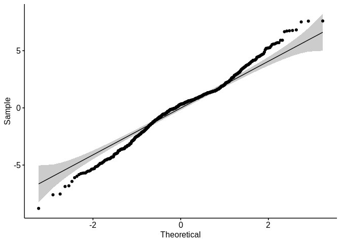
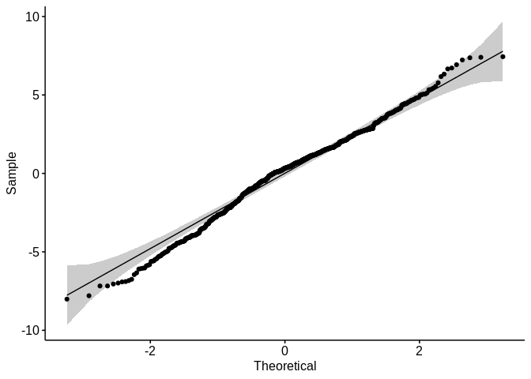

Regresijska Analiza
================

``` r
library('lme4')
```

    ## Loading required package: Matrix

``` r
library('lmerTest')
```

    ## 
    ## Attaching package: 'lmerTest'

    ## The following object is masked from 'package:lme4':
    ## 
    ##     lmer

    ## The following object is masked from 'package:stats':
    ## 
    ##     step

``` r
library('ggpubr')
```

    ## Loading required package: ggplot2

    ## Loading required package: magrittr

## Procesiranje podatkov

Pred nalaganjem podatkov smo spremenljivko `env brightness`
kategorizirali, saj smo po deskriptivni analizi podatkov ugotovili, da
ima veliko ekstremnih vrednosti (vrednost parametra `kurtosis` znaša kar
44). Do problema pride, ker senzorji dajejo zelo nizke vrednosti, ko je
uporabnik v zaprtem, v primerjavi z vrednostimi, ko je uporabnik na
odprtem.

Najprej sem poskusil problem rešiti tako, da sem odstranil vse
vrednosti, ki odstopajo za 3.5 standardnih deviacij od povprečja, a se
izkaže, da so reziduali linearnih modelov še vedno nenormalno
porazdeljeni.

Spremenljivka `env brightness` je sedaj kategorizirana na 5 nivojev.
Meje sem določil s pomočjo tabele, ki jo lahko najdete na
<a href="https://en.wikipedia.org/wiki/Lux" target="_blank">wikipediji</a>:

<ul>

<li>

L1 - 0-20 lux

</li>

<li>

L2 - 21-50 lux

</li>

<li>

L3 - 51-100 lux

</li>

<li>

L4 - 101-500 lux

</li>

<li>

L5 - vrednosti večje kot 500 lux

</li>

</ul>

Najprej bomo naložili vse podatke. Temu sledi standardizacija zveznih
spremenljivk (za vsako vrednost izračunamo z-score), kar nam omogoča
lažjo intepretracijo rezultatov. Lažje je namreč analizirati intercepte
pri regresiji, saj nam npr. vrednost ocene, ko je ura 00:00h, manj pove
kot povprečna vrednost ure, ko so uporabniki aplikacijo uporabljali.
Enako velja tudi za ostale zvezne parametre konteksta. S tem pa še vedno
ohranimo razdaljo med posameznimi vrednostmi.

``` r
df <- read.csv('data.csv', header=TRUE)
df$sb2 <- scale(df$screen.brightness, center = TRUE, scale = TRUE)
df$tod2 <- scale(df$time.of.day, center=TRUE, scale = TRUE)
df$bl2 <- scale(df$battery.level, center=TRUE, scale = TRUE)
```

## Pregred vrednosti podatkov

Spodnji izpis prikazuje prvih nekaj vrednosti podatkov, ki jih
obdelujemo.

<ul>

<li>

user.activity = fizična aktivnost uporabnika

</li>

<li>

env.brightness = svetlost okolice (kategorizirana)

</li>

<li>

screen.brightness = svetlost zaslona (sb2 standardizirana vrednost)

</li>

<li>

time of day = čaz oz. ura uporabe aplikacije v dnevu (tod2
standardizirana vrednost)

</li>

<li>

internet.speed = hitrost internetne povezave

</li>

<li>

battery.level = nivo baterije (bl2 standardizirana vrednost)

</li>

<li>

images = pove ali so slike bile prisotne

</li>

<li>

theme = tema aplikacije

</li>

<li>

layout = način prikaza novic

</li>

<li>

font.size = velikost pisave

</li>

<li>

str\_all = niz znakov dolžine štiri, ki združuje celoten izhod
aplikacije (layout + theme + images + font.size). Vsaka črka predstavlja
eno vrednost

</li>

</ul>

Temu pa še sledijo posamezne vrednosti vprašalnika razporejene po
kategorijah <br />

<ul>

<li>

p\_score - angl. personal preference score (predstavlja splošno oceno
pogleda aplikacije glede na osebno stališče uporabnika)

</li>

<li>

i\_score - angl. informativness score (predstavlja oceno informativnosti
pogleda aplikacije)

</li>

<li>

r\_score - angl. readablity score (predstavlja oceno berljivosti pogleda
aplikacije)

</li>

<li>

score - predstavlja skupaj sešteto oceno vseh treh kategorij
    vprašalnika

</li>

</ul>

``` r
head(df)
```

    ##   X user.activity env.brightness screen.brightness time.of.day internet.speed
    ## 1 0         STILL             L1                79          17              2
    ## 2 1         STILL             L1                79          17              2
    ## 3 2         STILL             L1                79          17              2
    ## 4 3         STILL             L1                79          17              2
    ## 5 4         STILL             L1                79          17              2
    ## 6 5         STILL             L1                79          17              2
    ##   battery.level     images      theme     layout  font.size str_all p_score
    ## 1            93 withImages dark-theme largeCards small-font    ldws       1
    ## 2            93 withImages dark-theme largeCards small-font    ldws       1
    ## 3            93 withImages dark-theme   gridView small-font    gdws       1
    ## 4            92 withImages dark-theme   gridView small-font    gdws       2
    ## 5            92 withImages dark-theme largeCards large-font    ldwl       1
    ## 6            92 withImages dark-theme largeCards large-font    ldwl       1
    ##   r_score i_score score  is_ua y_n        sb2      tod2      bl2
    ## 1       1       1     3 2STILL   1 -0.9290386 0.8075835 1.331422
    ## 2       1       1     3 2STILL   1 -0.9290386 0.8075835 1.331422
    ## 3       2       1     4 2STILL   1 -0.9290386 0.8075835 1.331422
    ## 4       2       1     5 2STILL   1 -0.9290386 0.8075835 1.289477
    ## 5       2       1     4 2STILL   1 -0.9290386 0.8075835 1.289477
    ## 6       2       1     4 2STILL   1 -0.9290386 0.8075835 1.289477

### Analiza linearne regresije

Funkcija `compare_BIC_AIC_ANOVA` primerja podana modela med seboj s pomočjo klicev funkcij `AIC`, `BIC` in `anova`.


AIC daje prednost tistim modelom, ki so morda bolj kompleksni, ampak
imajo boljšo predikcijo medtem ko BIC daje prednost modelom z manj
parametri. Funkcija anova pa izvede hi kvadrat test modelov m1 in m2
(preveri ali je res manjša vsota kvadratov rezidualov statistično
relevantna).

``` r
compare_BIC_AIC_ANOVA <- function(m1, m2) {
  print(AIC(m1,m2))
  print("=================")
  print(BIC(m1,m2))
  print("=================")
  print(anova(m1, m2))
}
```

## Analiza linearne regresije

Izgradnjo modela bomo v nadaljevanju gradili postopoma od bolj
kompleksnega (model, ki vsebuje vse parametre) k enostavnejšemu, tako da
bomo odstranjevali posamezne parametre.

Spodnja funkcija nam pove, da so vsi koeficienti statistično relevantni,
saj imajo p vrednosti manjše kot 0.05 (kar pomeni, da so različni od 0),
razen time of day, zato bomo poskusili time of day izločiti iz
modela.

``` r
lm.all <- lm(formula = score ~ sb2 + bl2 + tod2 + env.brightness + internet.speed + user.activity + layout + images + font.size + theme,
                     data = df)
summary(lm.all)
```

    ## 
    ## Call:
    ## lm(formula = score ~ sb2 + bl2 + tod2 + env.brightness + internet.speed + 
    ##     user.activity + layout + images + font.size + theme, data = df)
    ## 
    ## Residuals:
    ##    Min     1Q Median     3Q    Max 
    ## -8.789 -1.567  0.271  1.784  7.572 
    ## 
    ## Coefficients:
    ##                       Estimate Std. Error t value Pr(>|t|)    
    ## (Intercept)          -0.712444   0.698761  -1.020 0.308228    
    ## sb2                  -0.295446   0.113625  -2.600 0.009486 ** 
    ## bl2                  -0.705191   0.098584  -7.153 1.88e-12 ***
    ## tod2                 -0.002296   0.098087  -0.023 0.981327    
    ## env.brightnessL2      0.036249   0.378690   0.096 0.923765    
    ## env.brightnessL3     -1.228051   0.287573  -4.270 2.18e-05 ***
    ## env.brightnessL4     -2.853831   1.912704  -1.492 0.136074    
    ## env.brightnessL5     -1.237061   0.242954  -5.092 4.40e-07 ***
    ## internet.speed       -1.944529   0.206081  -9.436  < 2e-16 ***
    ## user.activityON_FOOT  1.957515   0.333890   5.863 6.60e-09 ***
    ## user.activitySTILL    2.724527   0.322118   8.458  < 2e-16 ***
    ## layoutlargeCards      2.512018   0.423266   5.935 4.34e-09 ***
    ## layoutminiCards       1.491715   0.463629   3.217 0.001344 ** 
    ## layoutxLargeCards     1.465069   0.433287   3.381 0.000756 ***
    ## imageswithImages      3.213564   0.253827  12.660  < 2e-16 ***
    ## font.sizesmall-font  -0.623916   0.194754  -3.204 0.001410 ** 
    ## themelight-theme      0.834697   0.196850   4.240 2.49e-05 ***
    ## ---
    ## Signif. codes:  0 '***' 0.001 '**' 0.01 '*' 0.05 '.' 0.1 ' ' 1
    ## 
    ## Residual standard error: 2.653 on 819 degrees of freedom
    ## Multiple R-squared:  0.588,  Adjusted R-squared:   0.58 
    ## F-statistic: 73.06 on 16 and 819 DF,  p-value: < 2.2e-16

Iz spodnjega izpisa vidimo, da so sedaj vsi koeficienti statistično
pomembni (različni od
0).

``` r
lm.all.NO_TOD <- lm(formula = score ~ sb2 + bl2 + env.brightness + internet.speed + user.activity + layout + images + font.size + theme,
                     data = df)
summary(lm.all.NO_TOD)
```

    ## 
    ## Call:
    ## lm(formula = score ~ sb2 + bl2 + env.brightness + internet.speed + 
    ##     user.activity + layout + images + font.size + theme, data = df)
    ## 
    ## Residuals:
    ##    Min     1Q Median     3Q    Max 
    ## -8.792 -1.566  0.272  1.784  7.570 
    ## 
    ## Coefficients:
    ##                      Estimate Std. Error t value Pr(>|t|)    
    ## (Intercept)          -0.71169    0.69758  -1.020 0.307928    
    ## sb2                  -0.29525    0.11324  -2.607 0.009292 ** 
    ## bl2                  -0.70534    0.09832  -7.174 1.63e-12 ***
    ## env.brightnessL2      0.03691    0.37741   0.098 0.922123    
    ## env.brightnessL3     -1.22848    0.28680  -4.283 2.06e-05 ***
    ## env.brightnessL4     -2.85332    1.91141  -1.493 0.135879    
    ## env.brightnessL5     -1.23713    0.24279  -5.096 4.32e-07 ***
    ## internet.speed       -1.94506    0.20471  -9.501  < 2e-16 ***
    ## user.activityON_FOOT  1.95735    0.33361   5.867 6.43e-09 ***
    ## user.activitySTILL    2.72492    0.32148   8.476  < 2e-16 ***
    ## layoutlargeCards      2.51205    0.42301   5.939 4.24e-09 ***
    ## layoutminiCards       1.49161    0.46332   3.219 0.001335 ** 
    ## layoutxLargeCards     1.46544    0.43274   3.386 0.000742 ***
    ## imageswithImages      3.21372    0.25359  12.673  < 2e-16 ***
    ## font.sizesmall-font  -0.62406    0.19454  -3.208 0.001389 ** 
    ## themelight-theme      0.83391    0.19386   4.302 1.90e-05 ***
    ## ---
    ## Signif. codes:  0 '***' 0.001 '**' 0.01 '*' 0.05 '.' 0.1 ' ' 1
    ## 
    ## Residual standard error: 2.651 on 820 degrees of freedom
    ## Multiple R-squared:  0.588,  Adjusted R-squared:  0.5805 
    ## F-statistic: 78.03 on 15 and 820 DF,  p-value: < 2.2e-16

Na podlagi funkcije `compare_BIC_AIC_ANOVA` opazimo, da model brez
parametra `tod2` daje boljše rezultate (manjše vrednosti ocen AIC in
BIC). Prav tako pa anova test pove, da ni statistično relevantne razlike
med modeloma, če izločimo uro pri napovedovanju ocene uporabnika.

``` r
compare_BIC_AIC_ANOVA(lm.all.NO_TOD, lm.all)
```

    ##    df      AIC
    ## m1 17 4020.534
    ## m2 18 4022.533
    ## [1] "================="
    ##    df      BIC
    ## m1 17 4100.921
    ## m2 18 4107.649
    ## [1] "================="
    ## Analysis of Variance Table
    ## 
    ## Model 1: score ~ sb2 + bl2 + env.brightness + internet.speed + user.activity + 
    ##     layout + images + font.size + theme
    ## Model 2: score ~ sb2 + bl2 + tod2 + env.brightness + internet.speed + 
    ##     user.activity + layout + images + font.size + theme
    ##   Res.Df    RSS Df Sum of Sq     F Pr(>F)
    ## 1    820 5763.7                          
    ## 2    819 5763.7  1 0.0038574 5e-04 0.9813

V nadaljevanju bomo podobno poskusili z ostalimi parametri, želimo
namreč najenostavnejši model, ki najboljše opisuje
podatke.

#### Poskusimo izločiti svetlost okolice


``` r
lm.all.NO_TOD_EB2 <- lm(formula = score ~ sb2 + bl2 + internet.speed + user.activity + layout + images + font.size + theme,
                     data = df)
summary(lm.all.NO_TOD_EB2)
```

    ## 
    ## Call:
    ## lm(formula = score ~ sb2 + bl2 + internet.speed + user.activity + 
    ##     layout + images + font.size + theme, data = df)
    ## 
    ## Residuals:
    ##     Min      1Q  Median      3Q     Max 
    ## -9.8830 -1.5848  0.3441  1.6278  8.5560 
    ## 
    ## Coefficients:
    ##                      Estimate Std. Error t value Pr(>|t|)    
    ## (Intercept)          -1.64711    0.68560  -2.402 0.016506 *  
    ## sb2                  -0.38559    0.10948  -3.522 0.000452 ***
    ## bl2                  -0.67358    0.09985  -6.746 2.86e-11 ***
    ## internet.speed       -2.02872    0.20690  -9.805  < 2e-16 ***
    ## user.activityON_FOOT  2.13393    0.33860   6.302 4.77e-10 ***
    ## user.activitySTILL    3.19125    0.31681  10.073  < 2e-16 ***
    ## layoutlargeCards      2.62953    0.42863   6.135 1.32e-09 ***
    ## layoutminiCards       1.51306    0.47082   3.214 0.001362 ** 
    ## layoutxLargeCards     1.36153    0.43833   3.106 0.001960 ** 
    ## imageswithImages      3.42969    0.25228  13.595  < 2e-16 ***
    ## font.sizesmall-font  -0.68682    0.19738  -3.480 0.000528 ***
    ## themelight-theme      0.65893    0.19170   3.437 0.000617 ***
    ## ---
    ## Signif. codes:  0 '***' 0.001 '**' 0.01 '*' 0.05 '.' 0.1 ' ' 1
    ## 
    ## Residual standard error: 2.704 on 824 degrees of freedom
    ## Multiple R-squared:  0.5694, Adjusted R-squared:  0.5636 
    ## F-statistic: 99.05 on 11 and 824 DF,  p-value: < 2.2e-16

Opazimo, da je model, ki vsebuje svetlost okolice boljši, saj ima manjšo
vrednost AIC in BIC. Prav tako pa anova nakazuje na statistično
relevantno razliko med modeloma. Svetlosti okolice torej ne smemo
izločiti.

``` r
compare_BIC_AIC_ANOVA(lm.all.NO_TOD_EB2, lm.all.NO_TOD)
```

    ##    df      AIC
    ## m1 13 4049.535
    ## m2 17 4020.534
    ## [1] "================="
    ##    df      BIC
    ## m1 13 4111.007
    ## m2 17 4100.921
    ## [1] "================="
    ## Analysis of Variance Table
    ## 
    ## Model 1: score ~ sb2 + bl2 + internet.speed + user.activity + layout + 
    ##     images + font.size + theme
    ## Model 2: score ~ sb2 + bl2 + env.brightness + internet.speed + user.activity + 
    ##     layout + images + font.size + theme
    ##   Res.Df    RSS Df Sum of Sq      F    Pr(>F)    
    ## 1    824 6024.5                                  
    ## 2    820 5763.7  4    260.83 9.2769 2.467e-07 ***
    ## ---
    ## Signif. codes:  0 '***' 0.001 '**' 0.01 '*' 0.05 '.' 0.1 ' ' 1

#### Poskusimo izločiti svetlost zaslona

``` r
lm.all.NO_TOD_SB2 <- lm(formula = score ~ bl2 + env.brightness + internet.speed + user.activity + layout + images + font.size + theme,
                     data = df)
summary(lm.all.NO_TOD_SB2)
```

    ## 
    ## Call:
    ## lm(formula = score ~ bl2 + env.brightness + internet.speed + 
    ##     user.activity + layout + images + font.size + theme, data = df)
    ## 
    ## Residuals:
    ##     Min      1Q  Median      3Q     Max 
    ## -8.3347 -1.6095  0.2984  1.7416  7.8218 
    ## 
    ## Coefficients:
    ##                      Estimate Std. Error t value Pr(>|t|)    
    ## (Intercept)          -1.27166    0.66604  -1.909 0.056574 .  
    ## bl2                  -0.71576    0.09859  -7.260 8.98e-13 ***
    ## env.brightnessL2     -0.06044    0.37689  -0.160 0.872629    
    ## env.brightnessL3     -1.18985    0.28743  -4.140 3.84e-05 ***
    ## env.brightnessL4     -2.69618    1.91720  -1.406 0.160010    
    ## env.brightnessL5     -1.40477    0.23494  -5.979 3.34e-09 ***
    ## internet.speed       -1.68271    0.17890  -9.406  < 2e-16 ***
    ## user.activityON_FOOT  2.08570    0.33112   6.299 4.88e-10 ***
    ## user.activitySTILL    2.84080    0.31951   8.891  < 2e-16 ***
    ## layoutlargeCards      2.57836    0.42373   6.085 1.79e-09 ***
    ## layoutminiCards       1.53666    0.46463   3.307 0.000983 ***
    ## layoutxLargeCards     1.51044    0.43392   3.481 0.000526 ***
    ## imageswithImages      3.24983    0.25410  12.789  < 2e-16 ***
    ## font.sizesmall-font  -0.59033    0.19479  -3.031 0.002517 ** 
    ## themelight-theme      0.93995    0.19022   4.942 9.40e-07 ***
    ## ---
    ## Signif. codes:  0 '***' 0.001 '**' 0.01 '*' 0.05 '.' 0.1 ' ' 1
    ## 
    ## Residual standard error: 2.661 on 821 degrees of freedom
    ## Multiple R-squared:  0.5846, Adjusted R-squared:  0.5775 
    ## F-statistic: 82.53 on 14 and 821 DF,  p-value: < 2.2e-16

Opazimo, da je model, ki vsebuje svetlost zaslona boljši, saj ima manjšo
vrednost AIC in BIC. Prav tako pa anova nakazuje na statistično
relevantno razliko med modeloma. Svetlosti zaslona torej ne smemo
izločiti.

``` r
compare_BIC_AIC_ANOVA(lm.all.NO_TOD_SB2, lm.all.NO_TOD)
```

    ##    df      AIC
    ## m1 16 4025.436
    ## m2 17 4020.534
    ## [1] "================="
    ##    df      BIC
    ## m1 16 4101.094
    ## m2 17 4100.921
    ## [1] "================="
    ## Analysis of Variance Table
    ## 
    ## Model 1: score ~ bl2 + env.brightness + internet.speed + user.activity + 
    ##     layout + images + font.size + theme
    ## Model 2: score ~ sb2 + bl2 + env.brightness + internet.speed + user.activity + 
    ##     layout + images + font.size + theme
    ##   Res.Df    RSS Df Sum of Sq     F   Pr(>F)   
    ## 1    821 5811.5                               
    ## 2    820 5763.7  1    47.783 6.798 0.009292 **
    ## ---
    ## Signif. codes:  0 '***' 0.001 '**' 0.01 '*' 0.05 '.' 0.1 ' ' 1

#### Poskusimo izločiti nivo baterije

``` r
lm.all.NO_TOD_BL2 <- lm(formula = score ~ sb2 + env.brightness + internet.speed + user.activity + layout + images + font.size + theme,
                     data = df)
summary(lm.all.NO_TOD_BL2)
```

    ## 
    ## Call:
    ## lm(formula = score ~ sb2 + env.brightness + internet.speed + 
    ##     user.activity + layout + images + font.size + theme, data = df)
    ## 
    ## Residuals:
    ##     Min      1Q  Median      3Q     Max 
    ## -9.0884 -1.5704  0.2568  1.8964  7.8738 
    ## 
    ## Coefficients:
    ##                      Estimate Std. Error t value Pr(>|t|)    
    ## (Intercept)          -1.13652    0.71611  -1.587 0.112879    
    ## sb2                  -0.32827    0.11657  -2.816 0.004979 ** 
    ## env.brightnessL2      0.05097    0.38884   0.131 0.895746    
    ## env.brightnessL3     -1.05021    0.29437  -3.568 0.000381 ***
    ## env.brightnessL4     -2.50782    1.96866  -1.274 0.203069    
    ## env.brightnessL5     -1.21668    0.25012  -4.864 1.38e-06 ***
    ## internet.speed       -2.18036    0.20818 -10.473  < 2e-16 ***
    ## user.activityON_FOOT  2.13541    0.34276   6.230 7.44e-10 ***
    ## user.activitySTILL    3.02938    0.32831   9.227  < 2e-16 ***
    ## layoutlargeCards      2.87967    0.43260   6.657 5.12e-11 ***
    ## layoutminiCards       1.72620    0.47616   3.625 0.000306 ***
    ## layoutxLargeCards     1.72220    0.44431   3.876 0.000115 ***
    ## imageswithImages      3.37201    0.26028  12.956  < 2e-16 ***
    ## font.sizesmall-font  -0.52856    0.19996  -2.643 0.008365 ** 
    ## themelight-theme      0.89052    0.19956   4.462 9.24e-06 ***
    ## ---
    ## Signif. codes:  0 '***' 0.001 '**' 0.01 '*' 0.05 '.' 0.1 ' ' 1
    ## 
    ## Residual standard error: 2.731 on 821 degrees of freedom
    ## Multiple R-squared:  0.5622, Adjusted R-squared:  0.5547 
    ## F-statistic:  75.3 on 14 and 821 DF,  p-value: < 2.2e-16

Opazimo, da je model, ki vsebuje nivo baterije boljši, saj ima manjšo
vrednost AIC in BIC. Prav tako pa anova nakazuje na statistično
relevantno razliko med modeloma. Nivo baterije torej ne smemo izločiti.

``` r
compare_BIC_AIC_ANOVA(lm.all.NO_TOD_BL2, lm.all.NO_TOD)
```

    ##    df      AIC
    ## m1 16 4069.421
    ## m2 17 4020.534
    ## [1] "================="
    ##    df      BIC
    ## m1 16 4145.079
    ## m2 17 4100.921
    ## [1] "================="
    ## Analysis of Variance Table
    ## 
    ## Model 1: score ~ sb2 + env.brightness + internet.speed + user.activity + 
    ##     layout + images + font.size + theme
    ## Model 2: score ~ sb2 + bl2 + env.brightness + internet.speed + user.activity + 
    ##     layout + images + font.size + theme
    ##   Res.Df    RSS Df Sum of Sq      F    Pr(>F)    
    ## 1    821 6125.4                                  
    ## 2    820 5763.7  1    361.73 51.463 1.632e-12 ***
    ## ---
    ## Signif. codes:  0 '***' 0.001 '**' 0.01 '*' 0.05 '.' 0.1 ' ' 1

#### Poskusimo izločiti hitrost internetne povezave

``` r
lm.all.NO_TOD_INTERNET_SPEED<- lm(formula = score ~ sb2 + bl2 + env.brightness + user.activity + layout + images + font.size + theme,
                   data = df)
summary(lm.all.NO_TOD_INTERNET_SPEED)
```

    ## 
    ## Call:
    ## lm(formula = score ~ sb2 + bl2 + env.brightness + user.activity + 
    ##     layout + images + font.size + theme, data = df)
    ## 
    ## Residuals:
    ##     Min      1Q  Median      3Q     Max 
    ## -9.0222 -1.5311  0.2434  1.6663  7.9154 
    ## 
    ## Coefficients:
    ##                      Estimate Std. Error t value Pr(>|t|)    
    ## (Intercept)           -4.4802     0.6042  -7.415 3.04e-13 ***
    ## sb2                    0.2336     0.1038   2.250 0.024737 *  
    ## bl2                   -0.8550     0.1022  -8.367 2.53e-16 ***
    ## env.brightnessL2      -0.0124     0.3974  -0.031 0.975119    
    ## env.brightnessL3      -1.1561     0.3019  -3.830 0.000138 ***
    ## env.brightnessL4      -3.3269     2.0120  -1.654 0.098604 .  
    ## env.brightnessL5      -1.4905     0.2541  -5.866 6.49e-09 ***
    ## user.activityON_FOOT   2.6054     0.3439   7.577 9.54e-14 ***
    ## user.activitySTILL     3.9192     0.3116  12.579  < 2e-16 ***
    ## layoutlargeCards       2.6539     0.4451   5.962 3.70e-09 ***
    ## layoutminiCards        1.6501     0.4875   3.384 0.000747 ***
    ## layoutxLargeCards      1.7255     0.4547   3.794 0.000159 ***
    ## imageswithImages       3.1402     0.2669  11.765  < 2e-16 ***
    ## font.sizesmall-font   -0.7020     0.2047  -3.430 0.000633 ***
    ## themelight-theme       1.0501     0.2027   5.180 2.79e-07 ***
    ## ---
    ## Signif. codes:  0 '***' 0.001 '**' 0.01 '*' 0.05 '.' 0.1 ' ' 1
    ## 
    ## Residual standard error: 2.792 on 821 degrees of freedom
    ## Multiple R-squared:  0.5427, Adjusted R-squared:  0.5349 
    ## F-statistic: 69.59 on 14 and 821 DF,  p-value: < 2.2e-16

Opazimo, da je model, ki vsebuje hitrost internetne povezave boljši, saj
ima manjšo vrednost AIC in BIC. Prav tako pa anova nakazuje na
statistično relevantno razliko med modeloma. Hitrosti internetne
povezave torej ne smemo izločiti.

``` r
compare_BIC_AIC_ANOVA(lm.all.NO_TOD_INTERNET_SPEED, lm.all.NO_TOD)
```

    ##    df      AIC
    ## m1 16 4105.850
    ## m2 17 4020.534
    ## [1] "================="
    ##    df      BIC
    ## m1 16 4181.508
    ## m2 17 4100.921
    ## [1] "================="
    ## Analysis of Variance Table
    ## 
    ## Model 1: score ~ sb2 + bl2 + env.brightness + user.activity + layout + 
    ##     images + font.size + theme
    ## Model 2: score ~ sb2 + bl2 + env.brightness + internet.speed + user.activity + 
    ##     layout + images + font.size + theme
    ##   Res.Df    RSS Df Sum of Sq      F    Pr(>F)    
    ## 1    821 6398.2                                  
    ## 2    820 5763.7  1    634.55 90.278 < 2.2e-16 ***
    ## ---
    ## Signif. codes:  0 '***' 0.001 '**' 0.01 '*' 0.05 '.' 0.1 ' ' 1

#### Poskusimo izločiti fizično aktivnost uporabnika

``` r
lm.all.NO_TOD_USER_ACTIVITY<- lm(formula = score ~ sb2 + bl2 + env.brightness + internet.speed + layout + images + font.size + theme,
                   data = df)
summary(lm.all.NO_TOD_USER_ACTIVITY)
```

    ## 
    ## Call:
    ## lm(formula = score ~ sb2 + bl2 + env.brightness + internet.speed + 
    ##     layout + images + font.size + theme, data = df)
    ## 
    ## Residuals:
    ##     Min      1Q  Median      3Q     Max 
    ## -8.0155 -1.8381  0.2344  1.7745  8.2763 
    ## 
    ## Coefficients:
    ##                     Estimate Std. Error t value Pr(>|t|)    
    ## (Intercept)          2.15953    0.63517   3.400 0.000707 ***
    ## sb2                 -0.42880    0.11650  -3.681 0.000248 ***
    ## bl2                 -0.81514    0.10149  -8.031 3.33e-15 ***
    ## env.brightnessL2     0.06775    0.39298   0.172 0.863167    
    ## env.brightnessL3    -1.48665    0.29659  -5.012 6.58e-07 ***
    ## env.brightnessL4    -3.36078    1.98880  -1.690 0.091434 .  
    ## env.brightnessL5    -1.73353    0.24329  -7.125 2.27e-12 ***
    ## internet.speed      -2.62168    0.19540 -13.417  < 2e-16 ***
    ## layoutlargeCards     2.81823    0.43898   6.420 2.30e-10 ***
    ## layoutminiCards      1.54709    0.48245   3.207 0.001394 ** 
    ## layoutxLargeCards    1.63906    0.44950   3.646 0.000283 ***
    ## imageswithImages     3.53822    0.26111  13.551  < 2e-16 ***
    ## font.sizesmall-font -0.67214    0.20244  -3.320 0.000939 ***
    ## themelight-theme     0.88695    0.20172   4.397 1.24e-05 ***
    ## ---
    ## Signif. codes:  0 '***' 0.001 '**' 0.01 '*' 0.05 '.' 0.1 ' ' 1
    ## 
    ## Residual standard error: 2.762 on 822 degrees of freedom
    ## Multiple R-squared:  0.5519, Adjusted R-squared:  0.5448 
    ## F-statistic: 77.89 on 13 and 822 DF,  p-value: < 2.2e-16

Opazimo, da je model, ki vsebuje fizično aktivnost uporabnika boljši,
saj ima manjšo vrednost AIC in BIC. Prav tako pa anova nakazuje na
statistično relevantno razliko med modeloma. Fizične aktivnosti
uporabnika torej ne smemo izločiti.

``` r
compare_BIC_AIC_ANOVA(lm.all.NO_TOD_USER_ACTIVITY, lm.all.NO_TOD)
```

    ##    df      AIC
    ## m1 15 4086.760
    ## m2 17 4020.534
    ## [1] "================="
    ##    df      BIC
    ## m1 15 4157.690
    ## m2 17 4100.921
    ## [1] "================="
    ## Analysis of Variance Table
    ## 
    ## Model 1: score ~ sb2 + bl2 + env.brightness + internet.speed + layout + 
    ##     images + font.size + theme
    ## Model 2: score ~ sb2 + bl2 + env.brightness + internet.speed + user.activity + 
    ##     layout + images + font.size + theme
    ##   Res.Df    RSS Df Sum of Sq      F    Pr(>F)    
    ## 1    822 6268.8                                  
    ## 2    820 5763.7  2    505.08 35.929 1.103e-15 ***
    ## ---
    ## Signif. codes:  0 '***' 0.001 '**' 0.01 '*' 0.05 '.' 0.1 ' ' 1

#### Poskusimo izločiti način prikaza novic oz. pogled (angl. layout)

``` r
lm.all.NO_TOD_LAYOUT<- lm(formula = score ~ sb2 + bl2 + env.brightness + internet.speed + user.activity + images + font.size + theme,
                   data = df)
summary(lm.all.NO_TOD_LAYOUT)
```

    ## 
    ## Call:
    ## lm(formula = score ~ sb2 + bl2 + env.brightness + internet.speed + 
    ##     user.activity + images + font.size + theme, data = df)
    ## 
    ## Residuals:
    ##     Min      1Q  Median      3Q     Max 
    ## -8.2761 -1.5446  0.4064  1.7804  8.0593 
    ## 
    ## Coefficients:
    ##                       Estimate Std. Error t value Pr(>|t|)    
    ## (Intercept)           1.402319   0.544356   2.576  0.01017 *  
    ## sb2                  -0.347597   0.116197  -2.991  0.00286 ** 
    ## bl2                  -0.796462   0.100216  -7.947 6.26e-15 ***
    ## env.brightnessL2      0.006825   0.387486   0.018  0.98595    
    ## env.brightnessL3     -1.501870   0.292203  -5.140 3.44e-07 ***
    ## env.brightnessL4     -3.490860   1.958585  -1.782  0.07506 .  
    ## env.brightnessL5     -1.357560   0.247235  -5.491 5.33e-08 ***
    ## internet.speed       -1.940611   0.209921  -9.244  < 2e-16 ***
    ## user.activityON_FOOT  2.009230   0.341646   5.881 5.93e-09 ***
    ## user.activitySTILL    2.986823   0.327945   9.108  < 2e-16 ***
    ## imageswithImages      2.899188   0.249414  11.624  < 2e-16 ***
    ## font.sizesmall-font  -0.794218   0.191888  -4.139 3.85e-05 ***
    ## themelight-theme      0.781691   0.198461   3.939 8.88e-05 ***
    ## ---
    ## Signif. codes:  0 '***' 0.001 '**' 0.01 '*' 0.05 '.' 0.1 ' ' 1
    ## 
    ## Residual standard error: 2.726 on 823 degrees of freedom
    ## Multiple R-squared:  0.5627, Adjusted R-squared:  0.5564 
    ## F-statistic: 88.26 on 12 and 823 DF,  p-value: < 2.2e-16

Opazimo, da je model, ki vsebuje način prikaza novic oz. pogled boljši,
saj ima manjšo vrednost AIC in BIC. Prav tako pa anova nakazuje na
statistično relevantno razliko med modeloma. Načina prikaza novic torej
ne smemo izločiti.

``` r
compare_BIC_AIC_ANOVA(lm.all.NO_TOD_LAYOUT, lm.all.NO_TOD)
```

    ##    df      AIC
    ## m1 14 4064.356
    ## m2 17 4020.534
    ## [1] "================="
    ##    df      BIC
    ## m1 14 4130.557
    ## m2 17 4100.921
    ## [1] "================="
    ## Analysis of Variance Table
    ## 
    ## Model 1: score ~ sb2 + bl2 + env.brightness + internet.speed + user.activity + 
    ##     images + font.size + theme
    ## Model 2: score ~ sb2 + bl2 + env.brightness + internet.speed + user.activity + 
    ##     layout + images + font.size + theme
    ##   Res.Df    RSS Df Sum of Sq      F    Pr(>F)    
    ## 1    823 6117.6                                  
    ## 2    820 5763.7  3    353.93 16.785 1.371e-10 ***
    ## ---
    ## Signif. codes:  0 '***' 0.001 '**' 0.01 '*' 0.05 '.' 0.1 ' ' 1

#### Poskusimo izločiti spremenljivko, ki pove ali so slike prisotne

``` r
lm.all.NO_TOD_IMAGES <- lm(formula = score ~ sb2 + bl2 + env.brightness + internet.speed + user.activity + layout + font.size + theme,
                   data = df)
summary(lm.all.NO_TOD_IMAGES)
```

    ## 
    ## Call:
    ## lm(formula = score ~ sb2 + bl2 + env.brightness + internet.speed + 
    ##     user.activity + layout + font.size + theme, data = df)
    ## 
    ## Residuals:
    ##      Min       1Q   Median       3Q      Max 
    ## -10.1361  -1.8490   0.3849   1.8935   8.5518 
    ## 
    ## Coefficients:
    ##                      Estimate Std. Error t value Pr(>|t|)    
    ## (Intercept)            2.4715     0.7112   3.475 0.000538 ***
    ## sb2                   -0.3736     0.1236  -3.024 0.002575 ** 
    ## bl2                   -0.8138     0.1070  -7.602 7.98e-14 ***
    ## env.brightnessL2      -0.4889     0.4100  -1.193 0.233368    
    ## env.brightnessL3      -1.9166     0.3078  -6.227 7.57e-10 ***
    ## env.brightnessL4      -5.3785     2.0776  -2.589 0.009800 ** 
    ## env.brightnessL5      -1.5232     0.2642  -5.766 1.15e-08 ***
    ## internet.speed        -1.8658     0.2236  -8.344 3.03e-16 ***
    ## user.activityON_FOOT   2.4269     0.3623   6.698 3.93e-11 ***
    ## user.activitySTILL     3.3394     0.3473   9.615  < 2e-16 ***
    ## layoutlargeCards       1.4686     0.4535   3.239 0.001249 ** 
    ## layoutminiCards        1.2527     0.5059   2.476 0.013488 *  
    ## layoutxLargeCards      0.3853     0.4637   0.831 0.406193    
    ## font.sizesmall-font   -0.8518     0.2117  -4.024 6.26e-05 ***
    ## themelight-theme       0.9132     0.2118   4.312 1.81e-05 ***
    ## ---
    ## Signif. codes:  0 '***' 0.001 '**' 0.01 '*' 0.05 '.' 0.1 ' ' 1
    ## 
    ## Residual standard error: 2.897 on 821 degrees of freedom
    ## Multiple R-squared:  0.5073, Adjusted R-squared:  0.4989 
    ## F-statistic: 60.39 on 14 and 821 DF,  p-value: < 2.2e-16

Opazimo, da je model, ki vsebuje spremenljivko, ki pove ali so slike
prisotne, boljši, saj ima manjšo vrednost AIC in BIC. Prav tako pa anova
nakazuje na statistično relevantno razliko med modeloma. Prisotnosti
slik pri napovedovanju ocene uporabnika torej ne smemo zanemariti.

``` r
compare_BIC_AIC_ANOVA(lm.all.NO_TOD_IMAGES, lm.all.NO_TOD)
```

    ##    df      AIC
    ## m1 16 4168.063
    ## m2 17 4020.534
    ## [1] "================="
    ##    df      BIC
    ## m1 16 4243.721
    ## m2 17 4100.921
    ## [1] "================="
    ## Analysis of Variance Table
    ## 
    ## Model 1: score ~ sb2 + bl2 + env.brightness + internet.speed + user.activity + 
    ##     layout + font.size + theme
    ## Model 2: score ~ sb2 + bl2 + env.brightness + internet.speed + user.activity + 
    ##     layout + images + font.size + theme
    ##   Res.Df    RSS Df Sum of Sq     F    Pr(>F)    
    ## 1    821 6892.5                                 
    ## 2    820 5763.7  1    1128.9 160.6 < 2.2e-16 ***
    ## ---
    ## Signif. codes:  0 '***' 0.001 '**' 0.01 '*' 0.05 '.' 0.1 ' ' 1

#### Poskusimo izločiti velikost pisave

``` r
lm.all.NO_TOD_FONT_SIZE <- lm(formula = score ~ sb2 + bl2 + env.brightness + internet.speed + user.activity + layout + images +  theme,
                   data = df)
summary(lm.all.NO_TOD_FONT_SIZE)
```

    ## 
    ## Call:
    ## lm(formula = score ~ sb2 + bl2 + env.brightness + internet.speed + 
    ##     user.activity + layout + images + theme, data = df)
    ## 
    ## Residuals:
    ##     Min      1Q  Median      3Q     Max 
    ## -8.3921 -1.5985  0.2929  1.7091  7.6653 
    ## 
    ## Coefficients:
    ##                      Estimate Std. Error t value Pr(>|t|)    
    ## (Intercept)          -1.40192    0.66732  -2.101   0.0360 *  
    ## sb2                  -0.27109    0.11363  -2.386   0.0173 *  
    ## bl2                  -0.68375    0.09864  -6.931 8.43e-12 ***
    ## env.brightnessL2      0.03482    0.37954   0.092   0.9269    
    ## env.brightnessL3     -1.21130    0.28837  -4.201 2.95e-05 ***
    ## env.brightnessL4     -3.13942    1.92011  -1.635   0.1024    
    ## env.brightnessL5     -1.29588    0.24346  -5.323 1.32e-07 ***
    ## internet.speed       -1.97276    0.20568  -9.591  < 2e-16 ***
    ## user.activityON_FOOT  2.00398    0.33518   5.979 3.35e-09 ***
    ## user.activitySTILL    2.75458    0.32316   8.524  < 2e-16 ***
    ## layoutlargeCards      2.84093    0.41271   6.884 1.16e-11 ***
    ## layoutminiCards       1.86536    0.45097   4.136 3.89e-05 ***
    ## layoutxLargeCards     1.84874    0.41826   4.420 1.12e-05 ***
    ## imageswithImages      3.28887    0.25393  12.952  < 2e-16 ***
    ## themelight-theme      0.87495    0.19453   4.498 7.86e-06 ***
    ## ---
    ## Signif. codes:  0 '***' 0.001 '**' 0.01 '*' 0.05 '.' 0.1 ' ' 1
    ## 
    ## Residual standard error: 2.666 on 821 degrees of freedom
    ## Multiple R-squared:  0.5829, Adjusted R-squared:  0.5757 
    ## F-statistic: 81.94 on 14 and 821 DF,  p-value: < 2.2e-16

Opazimo, da je model, ki vsebuje spremenljivko, ki pove, katera velikost
pisave je uporabljena, boljši, saj ima manjšo vrednost AIC in BIC. Prav
tako pa anova nakazuje na statistično relevantno razliko med modeloma.
Velikosti pisave pri napovedovanju ocene uporabnika torej ne smemo
zanemariti.

``` r
compare_BIC_AIC_ANOVA(lm.all.NO_TOD_FONT_SIZE, lm.all.NO_TOD)
```

    ##    df      AIC
    ## m1 16 4028.960
    ## m2 17 4020.534
    ## [1] "================="
    ##    df      BIC
    ## m1 16 4104.618
    ## m2 17 4100.921
    ## [1] "================="
    ## Analysis of Variance Table
    ## 
    ## Model 1: score ~ sb2 + bl2 + env.brightness + internet.speed + user.activity + 
    ##     layout + images + theme
    ## Model 2: score ~ sb2 + bl2 + env.brightness + internet.speed + user.activity + 
    ##     layout + images + font.size + theme
    ##   Res.Df    RSS Df Sum of Sq      F   Pr(>F)   
    ## 1    821 5836.0                                
    ## 2    820 5763.7  1    72.333 10.291 0.001389 **
    ## ---
    ## Signif. codes:  0 '***' 0.001 '**' 0.01 '*' 0.05 '.' 0.1 ' ' 1

#### Poskusimo izločiti temo aplikacije

``` r
lm.all.NO_TOD_THEME <- lm(formula = score ~ sb2 + bl2 + env.brightness + internet.speed + user.activity + layout + images + font.size,
                   data = df)
summary(lm.all.NO_TOD_THEME)
```

    ## 
    ## Call:
    ## lm(formula = score ~ sb2 + bl2 + env.brightness + internet.speed + 
    ##     user.activity + layout + images + font.size, data = df)
    ## 
    ## Residuals:
    ##     Min      1Q  Median      3Q     Max 
    ## -9.4223 -1.6507  0.2304  1.7574  7.7163 
    ## 
    ## Coefficients:
    ##                      Estimate Std. Error t value Pr(>|t|)    
    ## (Intercept)          -0.18639    0.69410  -0.269 0.788354    
    ## sb2                  -0.39744    0.11189  -3.552 0.000404 ***
    ## bl2                  -0.72255    0.09928  -7.278 7.94e-13 ***
    ## env.brightnessL2      0.31415    0.37581   0.836 0.403439    
    ## env.brightnessL3     -1.12478    0.28882  -3.894 0.000106 ***
    ## env.brightnessL4     -2.27090    1.92683  -1.179 0.238911    
    ## env.brightnessL5     -1.01862    0.23993  -4.245 2.43e-05 ***
    ## internet.speed       -2.04841    0.20545  -9.970  < 2e-16 ***
    ## user.activityON_FOOT  2.02363    0.33679   6.009 2.81e-09 ***
    ## user.activitySTILL    2.76899    0.32472   8.527  < 2e-16 ***
    ## layoutlargeCards      2.37044    0.42620   5.562 3.61e-08 ***
    ## layoutminiCards       1.31064    0.46630   2.811 0.005061 ** 
    ## layoutxLargeCards     1.30380    0.43568   2.993 0.002849 ** 
    ## imageswithImages      3.24890    0.25615  12.684  < 2e-16 ***
    ## font.sizesmall-font  -0.67928    0.19617  -3.463 0.000562 ***
    ## ---
    ## Signif. codes:  0 '***' 0.001 '**' 0.01 '*' 0.05 '.' 0.1 ' ' 1
    ## 
    ## Residual standard error: 2.679 on 821 degrees of freedom
    ## Multiple R-squared:  0.5787, Adjusted R-squared:  0.5715 
    ## F-statistic: 80.56 on 14 and 821 DF,  p-value: < 2.2e-16

Opazimo, da je model, ki vsebuje spremenljivko, ki pove katera tema je
uporabljena, boljši, saj ima manjšo vrednost AIC in BIC. Prav tako pa
anova nakazuje na statistično relevantno razliko med modeloma. Teme
aplikacije pri napovedovanju ocene uporabnika torej ne smemo zanemariti.

``` r
compare_BIC_AIC_ANOVA(lm.all.NO_TOD_THEME, lm.all.NO_TOD)
```

    ##    df      AIC
    ## m1 16 4037.189
    ## m2 17 4020.534
    ## [1] "================="
    ##    df      BIC
    ## m1 16 4112.847
    ## m2 17 4100.921
    ## [1] "================="
    ## Analysis of Variance Table
    ## 
    ## Model 1: score ~ sb2 + bl2 + env.brightness + internet.speed + user.activity + 
    ##     layout + images + font.size
    ## Model 2: score ~ sb2 + bl2 + env.brightness + internet.speed + user.activity + 
    ##     layout + images + font.size + theme
    ##   Res.Df    RSS Df Sum of Sq      F  Pr(>F)    
    ## 1    821 5893.7                                
    ## 2    820 5763.7  1    130.06 18.504 1.9e-05 ***
    ## ---
    ## Signif. codes:  0 '***' 0.001 '**' 0.01 '*' 0.05 '.' 0.1 ' ' 1

#### Končni sklep

Zgornja analiza je temeljila na linearni regresiji. Izkaže se, da je
spremenljivka tod2 (ura v dnevu) najmanj pomemben parameter, ki vpliva
na skupno oceno uporabnika.

## Multilevel modelling

Večinivojsko modeliranje je predvsem primerno pri raziskavah, kjer lahko
podatke grupiramo po določeni spremenljivki in gre za generalizacijo
linearne regresije. Poznamo več vrst različnih modelov: <br />

#### Random intercept model

Predstavlja modele, kjer dovolimo, da se intercepti oz. začetne
vrednosti regresijskih premic spreminjajo. Ta model predpostavlja, da so
koeficienti premic enaki. Z njim si lahko pomagamo pri računanju ICC oz.
intraclass correlation koeficientu, ki pove ali je večnivojsko
modeliranje potrebno (tipično vrednosti nad 0.05 nakazujejo, da je
večnivojsko modeliranje potrebno).

#### Random slopes model

Predstavlja modele, kjer se koeficienti lahko spreminjajo znotraj
različnih grup oz. skupin. Ta model predpostavlja, da so začetne
vrednosti enake.

#### Random intercept and slopes model

Najbolj realističen model, ki vsebuje različne začetne vrednosti kot
tudi koeficiente premic v različnih skupinah in je najbolj kompleksen.

Pri sami izgradnji modelov ni tako pomembno število vnosov znotraj
posamezne skupine. Bolj je pomembno je število različnih skupin, ki
znaša minimalno 5, priporočljivo pa je vsaj 20. V našem primeru je
najbolj smiselno podatke grupirati po spremenljivki `str_all`, saj
zadostujejo omenjenim pogojem.

Gradnjo modelov bomo začeli pri manj kompleksnih modelih (z manj
parametri) in postoma dodajali nove. Nato pa bomo spreminjali tudi
variabilnost začetnih vrednosti in koeficientov premic. Modele bomo
primerjali s pomočjo funkcije `anova`. Najboljši model bomo potem
primerjali še z ostalimi (Random forest, Bayesov klasifikator,
odločitveno drevo, AdaBoost).

### Izgradnja večnivojskega modela (angl. Multilevel Modela)

Gradnjo modelov bomo pričeli pri t.i. `random intercept modelu`, ki nam
bo povedal, ali je smiselno izvajati večnivojsko modeliranje.

Iz spodnjega izpisa lahko izračunamo vrednost ICC, ki znaša 5.35 / (5.35 + 11.80) = 0.312, kar pomeni, da lahko nadaljujemo z večnivojskim modeliranjem.

``` r
intercept.only.model <- lmer(formula = score ~ 1 + (1|str_all),
                             data=df)
summary(intercept.only.model)
```

    ## Linear mixed model fit by REML. t-tests use Satterthwaite's method [
    ## lmerModLmerTest]
    ## Formula: score ~ 1 + (1 | str_all)
    ##    Data: df
    ## 
    ## REML criterion at convergence: 4495
    ## 
    ## Scaled residuals: 
    ##     Min      1Q  Median      3Q     Max 
    ## -3.0300 -0.4364  0.2056  0.6264  2.5985 
    ## 
    ## Random effects:
    ##  Groups   Name        Variance Std.Dev.
    ##  str_all  (Intercept)  5.35    2.313   
    ##  Residual             11.80    3.435   
    ## Number of obs: 836, groups:  str_all, 22
    ## 
    ## Fixed effects:
    ##             Estimate Std. Error      df t value Pr(>|t|)   
    ## (Intercept)   1.6754     0.5121 21.3311   3.272  0.00359 **
    ## ---
    ## Signif. codes:  0 '***' 0.001 '**' 0.01 '*' 0.05 '.' 0.1 ' ' 1

#### Dodajamo nivo baterije

Opazimo, da ima novi model boljšo vrednost ocen AIC in BIC, prav tako pa
obstaja statistično relevantna razlika med reziduali modelov.
Spremenljivko `bl2` moramo torej obdržati.

``` r
m1 <- lmer(formula = score ~ 1 + bl2 + (1|str_all), 
           data=df)
summary(m1)
```

    ## Linear mixed model fit by REML. t-tests use Satterthwaite's method [
    ## lmerModLmerTest]
    ## Formula: score ~ 1 + bl2 + (1 | str_all)
    ##    Data: df
    ## 
    ## REML criterion at convergence: 4391.5
    ## 
    ## Scaled residuals: 
    ##     Min      1Q  Median      3Q     Max 
    ## -3.0293 -0.5935  0.1906  0.6810  2.9478 
    ## 
    ## Random effects:
    ##  Groups   Name        Variance Std.Dev.
    ##  str_all  (Intercept)  4.373   2.091   
    ##  Residual             10.425   3.229   
    ## Number of obs: 836, groups:  str_all, 22
    ## 
    ## Fixed effects:
    ##             Estimate Std. Error       df t value Pr(>|t|)    
    ## (Intercept)   1.7665     0.4644  21.3130   3.804  0.00102 ** 
    ## bl2          -1.2254     0.1153 819.8237 -10.624  < 2e-16 ***
    ## ---
    ## Signif. codes:  0 '***' 0.001 '**' 0.01 '*' 0.05 '.' 0.1 ' ' 1
    ## 
    ## Correlation of Fixed Effects:
    ##     (Intr)
    ## bl2 -0.018

``` r
anova(intercept.only.model, m1)
```

    ## refitting model(s) with ML (instead of REML)

    ## Data: df
    ## Models:
    ## intercept.only.model: score ~ 1 + (1 | str_all)
    ## m1: score ~ 1 + bl2 + (1 | str_all)
    ##                      npar    AIC    BIC  logLik deviance  Chisq Df Pr(>Chisq)
    ## intercept.only.model    3 4501.5 4515.7 -2247.7   4495.5                     
    ## m1                      4 4397.3 4416.3 -2194.7   4389.3 106.12  1  < 2.2e-16
    ##                         
    ## intercept.only.model    
    ## m1                   ***
    ## ---
    ## Signif. codes:  0 '***' 0.001 '**' 0.01 '*' 0.05 '.' 0.1 ' ' 1

#### Dodajamo svetlost zaslona

Iz spodnjega opisa vidimo, da spremenljivka `sb2` oz. svetlost zaslona
ne vpliva na končno oceno uporabnika, saj ima p vrednost 0.3449 (ničelna
hipoteza je v tem primeru, da je koeficient enak 0 alternativna pa da je
različen od 0).

Prav tako pa se izkaže, da ima predhodni model manjše vrednosti ocen BIC
in AIC. Anova test pa potrdi, da ni statistično relevantne razlike med
modeloma.

``` r
m2 <- lmer(formula = score ~ 1 + bl2 + sb2 + (1|str_all), 
           data=df)
summary(m2)
```

    ## Linear mixed model fit by REML. t-tests use Satterthwaite's method [
    ## lmerModLmerTest]
    ## Formula: score ~ 1 + bl2 + sb2 + (1 | str_all)
    ##    Data: df
    ## 
    ## REML criterion at convergence: 4393.1
    ## 
    ## Scaled residuals: 
    ##     Min      1Q  Median      3Q     Max 
    ## -2.9744 -0.5872  0.1851  0.6855  2.9058 
    ## 
    ## Random effects:
    ##  Groups   Name        Variance Std.Dev.
    ##  str_all  (Intercept)  4.423   2.103   
    ##  Residual             10.424   3.229   
    ## Number of obs: 836, groups:  str_all, 22
    ## 
    ## Fixed effects:
    ##             Estimate Std. Error       df t value Pr(>|t|)    
    ## (Intercept)   1.7607     0.4668  21.2746   3.772   0.0011 ** 
    ## bl2          -1.2225     0.1154 818.8365 -10.595   <2e-16 ***
    ## sb2           0.1090     0.1153 820.4910   0.945   0.3449    
    ## ---
    ## Signif. codes:  0 '***' 0.001 '**' 0.01 '*' 0.05 '.' 0.1 ' ' 1
    ## 
    ## Correlation of Fixed Effects:
    ##     (Intr) bl2   
    ## bl2 -0.018       
    ## sb2 -0.012  0.025

``` r
anova(m1, m2)
```

    ## refitting model(s) with ML (instead of REML)

    ## Data: df
    ## Models:
    ## m1: score ~ 1 + bl2 + (1 | str_all)
    ## m2: score ~ 1 + bl2 + sb2 + (1 | str_all)
    ##    npar    AIC    BIC  logLik deviance  Chisq Df Pr(>Chisq)
    ## m1    4 4397.3 4416.3 -2194.7   4389.3                     
    ## m2    5 4398.5 4422.1 -2194.2   4388.5 0.8838  1     0.3472

#### Dodajamo uro v dnevu

Tokrat se izkaže da čas v dnevu oz. parameter `tod2` ima vpliv na končno
oceno uporabnika, kar lahko razberemo iz tega, da p-vrednost pri klicu
funkcije `summary` znaša 0.001220. Prav tako pa ima nov model manjše
vrednosti AIC in BIC, anova test pa dodatno potrdi da obstaja
statistično relevantna razlika med modeloma.

``` r
m3 <- lmer(formula = score ~ 1 + bl2 + tod2 + (1|str_all), 
           data=df)
summary(m3)
```

    ## Linear mixed model fit by REML. t-tests use Satterthwaite's method [
    ## lmerModLmerTest]
    ## Formula: score ~ 1 + bl2 + tod2 + (1 | str_all)
    ##    Data: df
    ## 
    ## REML criterion at convergence: 4383.6
    ## 
    ## Scaled residuals: 
    ##     Min      1Q  Median      3Q     Max 
    ## -2.8398 -0.5963  0.1809  0.6726  2.7728 
    ## 
    ## Random effects:
    ##  Groups   Name        Variance Std.Dev.
    ##  str_all  (Intercept)  4.391   2.095   
    ##  Residual             10.303   3.210   
    ## Number of obs: 836, groups:  str_all, 22
    ## 
    ## Fixed effects:
    ##             Estimate Std. Error       df t value Pr(>|t|)    
    ## (Intercept)   1.7755     0.4650  21.2884   3.818 0.000983 ***
    ## bl2          -1.1828     0.1154 818.7904 -10.248  < 2e-16 ***
    ## tod2         -0.3718     0.1146 817.4250  -3.245 0.001220 ** 
    ## ---
    ## Signif. codes:  0 '***' 0.001 '**' 0.01 '*' 0.05 '.' 0.1 ' ' 1
    ## 
    ## Correlation of Fixed Effects:
    ##      (Intr) bl2   
    ## bl2  -0.017       
    ## tod2 -0.006 -0.113

``` r
anova(m1, m3)
```

    ## refitting model(s) with ML (instead of REML)

    ## Data: df
    ## Models:
    ## m1: score ~ 1 + bl2 + (1 | str_all)
    ## m3: score ~ 1 + bl2 + tod2 + (1 | str_all)
    ##    npar    AIC    BIC  logLik deviance  Chisq Df Pr(>Chisq)   
    ## m1    4 4397.3 4416.3 -2194.7   4389.3                        
    ## m3    5 4388.9 4412.5 -2189.4   4378.9 10.488  1   0.001202 **
    ## ---
    ## Signif. codes:  0 '***' 0.001 '**' 0.01 '*' 0.05 '.' 0.1 ' ' 1

#### Dodajamo svetlost okolice

Izkaže se, da svetlost okolice oz. parameter `env.brightness` ima vpliv
na končno oceno uporabnika (p vrednosti manjše kot 0.05). Prav tako pa
nov model dosega boljše rezultate ocen BIC in AIC. Anova test dodatno
potrdi da obstajajo statistično relevantne razlike med
modeloma.

``` r
m4 <- lmer(formula = score ~ 1 + bl2 + tod2 + env.brightness + (1|str_all), 
           data=df)
summary(m4)
```

    ## Linear mixed model fit by REML. t-tests use Satterthwaite's method [
    ## lmerModLmerTest]
    ## Formula: score ~ 1 + bl2 + tod2 + env.brightness + (1 | str_all)
    ##    Data: df
    ## 
    ## REML criterion at convergence: 4284
    ## 
    ## Scaled residuals: 
    ##     Min      1Q  Median      3Q     Max 
    ## -2.7523 -0.6210  0.1500  0.6557  3.1841 
    ## 
    ## Random effects:
    ##  Groups   Name        Variance Std.Dev.
    ##  str_all  (Intercept) 3.438    1.854   
    ##  Residual             9.240    3.040   
    ## Number of obs: 836, groups:  str_all, 22
    ## 
    ## Fixed effects:
    ##                   Estimate Std. Error        df t value Pr(>|t|)    
    ## (Intercept)        3.03957    0.44016  26.97395   6.906 2.03e-07 ***
    ## bl2               -1.13658    0.11031 816.35649 -10.303  < 2e-16 ***
    ## tod2              -0.27056    0.10957 814.41210  -2.469   0.0137 *  
    ## env.brightnessL2   0.08287    0.43595 815.53246   0.190   0.8493    
    ## env.brightnessL3  -1.57957    0.33317 818.80454  -4.741 2.51e-06 ***
    ## env.brightnessL4  -5.96126    2.29967 828.90903  -2.592   0.0097 ** 
    ## env.brightnessL5  -2.43637    0.26007 821.62575  -9.368  < 2e-16 ***
    ## ---
    ## Signif. codes:  0 '***' 0.001 '**' 0.01 '*' 0.05 '.' 0.1 ' ' 1
    ## 
    ## Correlation of Fixed Effects:
    ##             (Intr) bl2    tod2   env.L2 env.L3 env.L4
    ## bl2         -0.013                                   
    ## tod2         0.010 -0.114                            
    ## env.brghtL2 -0.171  0.004  0.083                     
    ## env.brghtL3 -0.237  0.082 -0.084  0.212              
    ## env.brghtL4 -0.056  0.029 -0.002  0.037  0.058       
    ## env.brghtL5 -0.306 -0.066 -0.053  0.282  0.389  0.062

``` r
anova(m3, m4)
```

    ## refitting model(s) with ML (instead of REML)

    ## Data: df
    ## Models:
    ## m3: score ~ 1 + bl2 + tod2 + (1 | str_all)
    ## m4: score ~ 1 + bl2 + tod2 + env.brightness + (1 | str_all)
    ##    npar    AIC    BIC  logLik deviance  Chisq Df Pr(>Chisq)    
    ## m3    5 4388.9 4412.5 -2189.4   4378.9                         
    ## m4    9 4299.1 4341.6 -2140.5   4281.1 97.805  4  < 2.2e-16 ***
    ## ---
    ## Signif. codes:  0 '***' 0.001 '**' 0.01 '*' 0.05 '.' 0.1 ' ' 1

### Dodajamo fizično aktivnost uporabnika

Tokrat pa vidimo, da v primeru, ko dodamo spremenljivko `user.activity`,
spremenljivka `tod2` izgubi vpliv (p-vrednost pri klicu funkcije
`summary` znaša 0.2543). Novi model ima sedaj boljšo oceno AIC in BIC,
prav tako pa anova potrdi, da obstajajo statistično relevantne razlike
med
modeloma.

``` r
m5 <- lmer(formula = score ~ 1 + bl2 + tod2 + env.brightness + user.activity + (1|str_all), 
           data=df)
summary(m5)
```

    ## Linear mixed model fit by REML. t-tests use Satterthwaite's method [
    ## lmerModLmerTest]
    ## Formula: score ~ 1 + bl2 + tod2 + env.brightness + user.activity + (1 |  
    ##     str_all)
    ##    Data: df
    ## 
    ## REML criterion at convergence: 4131.3
    ## 
    ## Scaled residuals: 
    ##     Min      1Q  Median      3Q     Max 
    ## -3.2214 -0.5695  0.1133  0.6367  2.7272 
    ## 
    ## Random effects:
    ##  Groups   Name        Variance Std.Dev.
    ##  str_all  (Intercept) 2.572    1.604   
    ##  Residual             7.711    2.777   
    ## Number of obs: 836, groups:  str_all, 22
    ## 
    ## Fixed effects:
    ##                       Estimate Std. Error        df t value Pr(>|t|)    
    ## (Intercept)           -0.43309    0.47295  61.66370  -0.916   0.3634    
    ## bl2                   -0.86322    0.10296 812.91628  -8.384 2.25e-16 ***
    ## tod2                  -0.11548    0.10122 812.88010  -1.141   0.2543    
    ## env.brightnessL2       0.08964    0.39821 814.08585   0.225   0.8220    
    ## env.brightnessL3      -1.20759    0.30588 816.67872  -3.948 8.56e-05 ***
    ## env.brightnessL4      -4.65801    2.10180 826.99841  -2.216   0.0269 *  
    ## env.brightnessL5      -1.41642    0.25111 818.81240  -5.641 2.33e-08 ***
    ## user.activityON_FOOT   2.65336    0.34451 813.37970   7.702 3.89e-14 ***
    ## user.activitySTILL     4.04377    0.31259 814.19114  12.936  < 2e-16 ***
    ## ---
    ## Signif. codes:  0 '***' 0.001 '**' 0.01 '*' 0.05 '.' 0.1 ' ' 1
    ## 
    ## Correlation of Fixed Effects:
    ##             (Intr) bl2    tod2   env.L2 env.L3 env.L4 env.L5 u.ON_F
    ## bl2         -0.125                                                 
    ## tod2        -0.045 -0.085                                          
    ## env.brghtL2 -0.144  0.004  0.084                                   
    ## env.brghtL3 -0.249  0.100 -0.068  0.212                            
    ## env.brghtL4 -0.079  0.038  0.001  0.036  0.060                     
    ## env.brghtL5 -0.413  0.005 -0.005  0.269  0.399  0.071              
    ## usr.ON_FOOT -0.441  0.110 -0.006 -0.015  0.024  0.055  0.117       
    ## usr.ctSTILL -0.577  0.203  0.107  0.000  0.091  0.052  0.304  0.671

``` r
anova(m4, m5)
```

    ## refitting model(s) with ML (instead of REML)

    ## Data: df
    ## Models:
    ## m4: score ~ 1 + bl2 + tod2 + env.brightness + (1 | str_all)
    ## m5: score ~ 1 + bl2 + tod2 + env.brightness + user.activity + (1 | 
    ## m5:     str_all)
    ##    npar    AIC    BIC  logLik deviance  Chisq Df Pr(>Chisq)    
    ## m4    9 4299.1 4341.6 -2140.5   4281.1                         
    ## m5   11 4147.6 4199.6 -2062.8   4125.6 155.49  2  < 2.2e-16 ***
    ## ---
    ## Signif. codes:  0 '***' 0.001 '**' 0.01 '*' 0.05 '.' 0.1 ' ' 1

### Dodajamo hitrost internetne povezave, odstranjujemo parameter `tod2`

Iz spodnjega izpisa lahko opazimo, da spremenljivka `internet.speed` ima
vpliv na končno oceno uporabnika (p-vrednost znaša 2e-16). Prav tako pa
ima nov model manjše AIC in BIC vrednost. Anova pa dodatno potrdi, da
obstajajo statistično relevantne razlike med
modeloma.

``` r
m6 <- lmer(formula = score ~ 1 + bl2 + env.brightness + user.activity + internet.speed + (1|str_all), 
           data=df)
summary(m6)
```

    ## Linear mixed model fit by REML. t-tests use Satterthwaite's method [
    ## lmerModLmerTest]
    ## Formula: score ~ 1 + bl2 + env.brightness + user.activity + internet.speed +  
    ##     (1 | str_all)
    ##    Data: df
    ## 
    ## REML criterion at convergence: 4055.3
    ## 
    ## Scaled residuals: 
    ##     Min      1Q  Median      3Q     Max 
    ## -3.0228 -0.6070  0.1206  0.6145  2.8058 
    ## 
    ## Random effects:
    ##  Groups   Name        Variance Std.Dev.
    ##  str_all  (Intercept) 2.606    1.614   
    ##  Residual             7.027    2.651   
    ## Number of obs: 836, groups:  str_all, 22
    ## 
    ## Fixed effects:
    ##                       Estimate Std. Error        df t value Pr(>|t|)    
    ## (Intercept)            2.67141    0.58164 132.34825   4.593 1.01e-05 ***
    ## bl2                   -0.72666    0.09930 812.55645  -7.318 6.05e-13 ***
    ## env.brightnessL2      -0.06761    0.37955 813.22727  -0.178   0.8587    
    ## env.brightnessL3      -1.22794    0.29144 815.87718  -4.213 2.80e-05 ***
    ## env.brightnessL4      -3.74870    2.01129 826.92496  -1.864   0.0627 .  
    ## env.brightnessL5      -1.49840    0.24001 817.88632  -6.243 6.88e-10 ***
    ## user.activityON_FOOT   2.16909    0.33326 812.91409   6.509 1.32e-10 ***
    ## user.activitySTILL     2.96336    0.32184 814.53301   9.208  < 2e-16 ***
    ## internet.speed        -1.61617    0.18096 812.86927  -8.931  < 2e-16 ***
    ## ---
    ## Signif. codes:  0 '***' 0.001 '**' 0.01 '*' 0.05 '.' 0.1 ' ' 1
    ## 
    ## Correlation of Fixed Effects:
    ##             (Intr) bl2    env.L2 env.L3 env.L4 env.L5 u.ON_F u.STIL
    ## bl2          0.000                                                 
    ## env.brghtL2 -0.145  0.002                                          
    ## env.brghtL3 -0.197  0.093  0.219                                   
    ## env.brghtL4 -0.032  0.046  0.033  0.061                            
    ## env.brghtL5 -0.344 -0.002  0.272  0.400  0.069                     
    ## usr.ON_FOOT -0.435  0.080 -0.005  0.024  0.047  0.122              
    ## usr.ctSTILL -0.645  0.132  0.014  0.092  0.029  0.297  0.677       
    ## internt.spd -0.603 -0.164  0.059  0.001 -0.049  0.039  0.160  0.387

``` r
anova(m5, m6)
```

    ## refitting model(s) with ML (instead of REML)

    ## Data: df
    ## Models:
    ## m5: score ~ 1 + bl2 + tod2 + env.brightness + user.activity + (1 | 
    ## m5:     str_all)
    ## m6: score ~ 1 + bl2 + env.brightness + user.activity + internet.speed + 
    ## m6:     (1 | str_all)
    ##    npar    AIC    BIC  logLik deviance  Chisq Df Pr(>Chisq)    
    ## m5   11 4147.6 4199.6 -2062.8   4125.6                         
    ## m6   11 4072.1 4124.1 -2025.0   4050.1 75.476  0  < 2.2e-16 ***
    ## ---
    ## Signif. codes:  0 '***' 0.001 '**' 0.01 '*' 0.05 '.' 0.1 ' ' 1

Trenutno najboljši zgrajeni model je `m6`. Zdaj lahko začenmo dodajati
t.i. `random slope`. V našem primeru to pomeni, da dovolimo, da imajo
premice različne koeficiente znotraj različnih skupin (vrednosti
spremenljivke `str_all`) oz. pogledov.

### Dodajamo `random slope`

Iz spodnjega izpisa opazimo, da ima nov model manjšo oceno AIC, vendar
ima zaradi svoje kompleksnosti večjo vrednst ocene BIC, zato bomo v
nadaljevanju izpustili `random slope` računan po spremenljivki
`bl2`.

``` r
m7 <- lmer(formula = score ~ 1 + bl2 + env.brightness + user.activity + internet.speed + (bl2|str_all), 
           data=df)
summary(m7)
```

    ## Linear mixed model fit by REML. t-tests use Satterthwaite's method [
    ## lmerModLmerTest]
    ## Formula: score ~ 1 + bl2 + env.brightness + user.activity + internet.speed +  
    ##     (bl2 | str_all)
    ##    Data: df
    ## 
    ## REML criterion at convergence: 4043.3
    ## 
    ## Scaled residuals: 
    ##     Min      1Q  Median      3Q     Max 
    ## -3.1611 -0.5689  0.1125  0.5872  2.9158 
    ## 
    ## Random effects:
    ##  Groups   Name        Variance Std.Dev. Corr
    ##  str_all  (Intercept) 2.5263   1.5894       
    ##           bl2         0.2224   0.4716   0.61
    ##  Residual             6.8335   2.6141       
    ## Number of obs: 836, groups:  str_all, 22
    ## 
    ## Fixed effects:
    ##                      Estimate Std. Error       df t value Pr(>|t|)    
    ## (Intercept)            2.6206     0.5770 135.2318   4.542 1.22e-05 ***
    ## bl2                   -0.8656     0.1476  20.6595  -5.864 8.59e-06 ***
    ## env.brightnessL2      -0.1235     0.3770 803.8094  -0.328   0.7433    
    ## env.brightnessL3      -1.2985     0.2880 805.2431  -4.508 7.50e-06 ***
    ## env.brightnessL4      -4.0024     1.9720 765.8439  -2.030   0.0427 *  
    ## env.brightnessL5      -1.4097     0.2378 815.6314  -5.928 4.53e-09 ***
    ## user.activityON_FOOT   2.1156     0.3306 807.9965   6.400 2.63e-10 ***
    ## user.activitySTILL     2.9135     0.3199 813.0106   9.108  < 2e-16 ***
    ## internet.speed        -1.5401     0.1804 811.6519  -8.537  < 2e-16 ***
    ## ---
    ## Signif. codes:  0 '***' 0.001 '**' 0.01 '*' 0.05 '.' 0.1 ' ' 1
    ## 
    ## Correlation of Fixed Effects:
    ##             (Intr) bl2    env.L2 env.L3 env.L4 env.L5 u.ON_F u.STIL
    ## bl2          0.240                                                 
    ## env.brghtL2 -0.143  0.012                                          
    ## env.brghtL3 -0.201  0.059  0.218                                   
    ## env.brghtL4 -0.032  0.034  0.033  0.059                            
    ## env.brghtL5 -0.343 -0.016  0.267  0.396  0.068                     
    ## usr.ON_FOOT -0.436  0.061 -0.007  0.027  0.047  0.116              
    ## usr.ctSTILL -0.647  0.112  0.015  0.097  0.031  0.289  0.677       
    ## internt.spd -0.607 -0.119  0.058  0.008 -0.049  0.049  0.157  0.385

``` r
anova(m6, m7)
```

    ## refitting model(s) with ML (instead of REML)

    ## Data: df
    ## Models:
    ## m6: score ~ 1 + bl2 + env.brightness + user.activity + internet.speed + 
    ## m6:     (1 | str_all)
    ## m7: score ~ 1 + bl2 + env.brightness + user.activity + internet.speed + 
    ## m7:     (bl2 | str_all)
    ##    npar    AIC    BIC  logLik deviance  Chisq Df Pr(>Chisq)   
    ## m6   11 4072.1 4124.1 -2025.0   4050.1                        
    ## m7   13 4064.6 4126.1 -2019.3   4038.6 11.507  2   0.003172 **
    ## ---
    ## Signif. codes:  0 '***' 0.001 '**' 0.01 '*' 0.05 '.' 0.1 ' ' 1

### Dodajmo interakcijo med spremenljivkama `internet.speed` in `user.activity`

Iz spodjega izpisa lahko razberemo, da je model `m8` boljši od modela
`m6`, vendar to sklepamo samo po vrednostih za `BIC` in `AIC`. Če
izrišemo porazdelitev rezidualov opazimo, da model `m8` odstopa od
normalne porazdelitve več kot model `m6`. Če reziduali niso normalno
porazdeljeni, to pomeni, da napake niso `slučajne`, zato bomo prednost
dali modelu `m6`.

To si lahko razlagamo s tem, da imamo premalo vnosov za vrednosti
`ON_FOOT` in `IN_VEHICLE`, vendar moramo pri napovedovanju nujno
upoštevati fizično aktivnost uporabnika, saj je sicer model slabši pri
napovedovanju.

``` r
m8 <- lmer(formula = score ~ 1 + bl2 + env.brightness + user.activity*internet.speed + (1|str_all), 
           data=df)
summary(m8)
```

    ## Linear mixed model fit by REML. t-tests use Satterthwaite's method [
    ## lmerModLmerTest]
    ## Formula: score ~ 1 + bl2 + env.brightness + user.activity * internet.speed +  
    ##     (1 | str_all)
    ##    Data: df
    ## 
    ## REML criterion at convergence: 3973.9
    ## 
    ## Scaled residuals: 
    ##     Min      1Q  Median      3Q     Max 
    ## -3.4694 -0.5515  0.1248  0.5381  3.0000 
    ## 
    ## Random effects:
    ##  Groups   Name        Variance Std.Dev.
    ##  str_all  (Intercept) 2.135    1.461   
    ##  Residual             6.418    2.533   
    ## Number of obs: 836, groups:  str_all, 22
    ## 
    ## Fixed effects:
    ##                                      Estimate Std. Error        df t value
    ## (Intercept)                          10.18071    2.20402 824.51718   4.619
    ## bl2                                  -0.60861    0.09650 809.97826  -6.307
    ## env.brightnessL2                      0.12835    0.36336 811.74351   0.353
    ## env.brightnessL3                     -0.91703    0.28065 814.06257  -3.268
    ## env.brightnessL4                     -3.91103    1.92000 824.99295  -2.037
    ## env.brightnessL5                     -1.25365    0.23157 817.07885  -5.414
    ## user.activityON_FOOT                 -0.05454    2.26681 812.25106  -0.024
    ## user.activitySTILL                   -5.46669    2.18576 814.26702  -2.501
    ## internet.speed                       -5.61924    1.11180 814.47134  -5.054
    ## user.activityON_FOOT:internet.speed   0.67248    1.17310 811.70406   0.573
    ## user.activitySTILL:internet.speed     4.71681    1.12547 814.58502   4.191
    ##                                     Pr(>|t|)    
    ## (Intercept)                         4.47e-06 ***
    ## bl2                                 4.68e-10 ***
    ## env.brightnessL2                     0.72401    
    ## env.brightnessL3                     0.00113 ** 
    ## env.brightnessL4                     0.04197 *  
    ## env.brightnessL5                    8.12e-08 ***
    ## user.activityON_FOOT                 0.98081    
    ## user.activitySTILL                   0.01258 *  
    ## internet.speed                      5.34e-07 ***
    ## user.activityON_FOOT:internet.speed  0.56664    
    ## user.activitySTILL:internet.speed   3.08e-05 ***
    ## ---
    ## Signif. codes:  0 '***' 0.001 '**' 0.01 '*' 0.05 '.' 0.1 ' ' 1
    ## 
    ## Correlation of Fixed Effects:
    ##             (Intr) bl2    env.L2 env.L3 env.L4 env.L5 us.ON_FOOT us.STILL
    ## bl2          0.160                                                       
    ## env.brghtL2 -0.030  0.008                                                
    ## env.brghtL3 -0.017  0.106  0.224                                         
    ## env.brghtL4  0.000  0.045  0.032  0.059                                  
    ## env.brghtL5 -0.111  0.005  0.277  0.408  0.067                           
    ## usr.ON_FOOT -0.935 -0.124  0.011  0.006 -0.004  0.080                    
    ## usr.ctSTILL -0.981 -0.149 -0.007 -0.025 -0.003  0.061  0.940             
    ## internt.spd -0.981 -0.189  0.002 -0.034 -0.015  0.029  0.937      0.986  
    ## u.ON_FOOT:.  0.915  0.130 -0.015 -0.009  0.011 -0.070 -0.989     -0.920  
    ## usr.STILL:.  0.966  0.171  0.011  0.043  0.007 -0.014 -0.923     -0.989  
    ##             intrn. u.ON_FOOT:
    ## bl2                          
    ## env.brghtL2                  
    ## env.brghtL3                  
    ## env.brghtL4                  
    ## env.brghtL5                  
    ## usr.ON_FOOT                  
    ## usr.ctSTILL                  
    ## internt.spd                  
    ## u.ON_FOOT:. -0.928           
    ## usr.STILL:. -0.986  0.915

``` r
ggqqplot(resid(m8))
```

<!-- -->

``` r
ggqqplot(resid(m6))
```

<!-- -->

``` r
anova(m6, m8)
```

    ## refitting model(s) with ML (instead of REML)

    ## Data: df
    ## Models:
    ## m6: score ~ 1 + bl2 + env.brightness + user.activity + internet.speed + 
    ## m6:     (1 | str_all)
    ## m8: score ~ 1 + bl2 + env.brightness + user.activity * internet.speed + 
    ## m8:     (1 | str_all)
    ##    npar    AIC    BIC logLik deviance  Chisq Df Pr(>Chisq)    
    ## m6   11 4072.1 4124.1  -2025   4050.1                         
    ## m8   13 3996.1 4057.6  -1985   3970.1 79.985  2  < 2.2e-16 ***
    ## ---
    ## Signif. codes:  0 '***' 0.001 '**' 0.01 '*' 0.05 '.' 0.1 ' ' 1

S spodnjo funkcijo si bomo pomagali pri ocenjavanju kakovosti modela s
pomočjo k-fold testiranja. Testiranje je izvedeno tako, da model
napoveduje uporabnikovo oceno, ki je nato primerjana z določenjo
vrednostjo, ki jo bomo v nadaljevanju uporabili za razlikovanje med
dobrimi in slabimi pogledi. Vse vrednosti, ki so večje ali enake
vrednosti oceni 3, se označijo kot pozitivne, v nasprotnem primeru pa
kot negativne. S tem dosežemo binarizacijo napovedovanja razreda in jo
bomo tudi uporabili pri gradnji in evaluaciji ostalih modelov.

``` r
kFold <- function(k){
  set.seed(0)
  
  model_results <- c()
  dummy_results <- c()
  
  n_all <- nrow(df)
  
  for(i in 1:k){
    n_train <- 1 - 1/k
    n_size <- ceiling(n_all*n_train)
    train_ind <- sample(seq_len(nrow(df)), size = n_size)
    train <- df[train_ind, ]
    test <- df[-train_ind, ]
    m6 <- lmer(formula = score ~ 1 + bl2 + env.brightness + user.activity + internet.speed + (1|str_all), data=train)
    
    counter <- 0
    vecinski <- 0
  
    for(row in 1:nrow(test)){
      prediction <- predict(m6, test[row,])
      if( (prediction >= 3 & test[row,]['score']>=3) || (prediction < 3 & test[row,]['score']<3) ) {
        counter <- counter + 1
      }
      
      if(test[row,]['score'] >= 3){
        vecinski <- vecinski + 1
      }
    }
    
    acc_model <- counter/nrow(test)
    acc_dummy <- vecinski/nrow(test)
    
    model_results <- c(model_results, acc_model)
    dummy_results <- c(dummy_results, acc_dummy)
  }
  
  sprintf("Mean model accuracy = %.2f | Mean dummy model accuracy = %.2f", mean(model_results), mean(dummy_results))
  
}
```

Na podlagi spodnjega klica lahko razberemo, da ima MULTILEVEL model 8%
večjo natančnost pri napovedovanju uporabnikove ocene kot večinski
klasifikator.

``` r
kFold(10)
```

    ## [1] "Mean model accuracy = 0.75 | Mean dummy model accuracy = 0.67"

Standardne metrike, ki jih uporabljamo pri evaluaciji modelov so
`Accuracy, Precision, Recall, F-measure`. Omenjene metrike lahko
izračunamo s pomočjo spodnje funkcije:

``` r
calcmetrics <- function(tp, fp, fn, tn){
  accuracy <- (tp + tn) / (tp + fp + fn + tn)
  precision <- tp / (tp + fp)
  recall <- tp / (tp + fn)
  fMeasure <- 2 /((1/precision) + (1/recall))
  
  print("==================")
  cat(sprintf("Accuracy = \"%f\"\n ", accuracy))
  cat(sprintf("Precision = \"%f\"\n ", precision))
  cat(sprintf("Recall = \"%f\"\n ", recall))
  cat(sprintf("f-measure = \"%f\"\n ", fMeasure))
}

evaluateModel <- function(){
  set.seed(0)
  n_size <- ceiling(836*0.8)
  train_ind <- sample(seq_len(nrow(df)), size = n_size)
  train <- df[train_ind, ]
  test <- df[-train_ind, ]
  m6 <- lmer(formula = score ~ 1 + bl2 + env.brightness + user.activity + internet.speed + (1|str_all), data=train)

  
  TP <- 0
  TN <- 0
  
  FP <- 0
  FN <- 0
  
  TP_V <- 0
  FP_V <- 0
  
  FN_V <- 0
  TN_V <- 0
  
  for(row in 1:nrow(test)){
    prediction <- predict(m6, test[row,])
    real_val <- test[row,]['score']
    
    if(prediction >= 3 & real_val>=3){
      TP <- TP + 1
    }
    
    if(prediction < 3 & real_val<3){
      TN <- TN + 1
    }
    
    if(prediction >= 3 & real_val<3){
      FP <- FP +1
    }
    
    if(prediction < 3 & real_val>=3){
      FN <- FN + 1
    }
    
    if(real_val >= 3){
      TP_V <- TP_V + 1
    }else{
      FP_V <- FP_V + 1
    }
    
  }
  calcmetrics(TP, FP, FN, TN)
  calcmetrics(TP_V, FP_V, FN_V, TN_V)  
}
```

Iz spodnjega izpisa lahko ugotovimo, da je novo zgrajen model boljši.

Ker se število predikcij tipa `false negative` poveča, se vrednost za `recall` zmanjša. 

Izkaže pa se, da se modelu poveča natančnost (`accuracy` znaša 0.75). Modelu se je torej povečalo
število pravilnih predikcij, torej predikcij tipa `true negative` in `true positive`.

Prav tako pa se modelu zmanjša število predikcij tipa `false positive`, kar pomeni, da
velikokrat pravilno napove pozitiven izhod in redkeje zgreši negativnega.
Temu primerno naraste mera `precision`.

V splošnem želimo maksimizirati obe vrednosti (`precision` in `recall`),
zato uporabimo mero `f-measure`. V našem primeru vidimo, da smo preveč
žrtvovali za povečanje vrednosti `precision`, saj se je `recall`
zmanjšal za večji faktor kot je `precision` narastel. Vrednost mere
`f-measure` je zato na koncu manjša kot pri večinskem klasifikatorju.

``` r
evaluateModel()
```

    ## [1] "=================="
    ## Accuracy = "0.748503"
    ##  Precision = "0.886364"
    ##  Recall = "0.709091"
    ##  f-measure = "0.787879"
    ##  [1] "=================="
    ## Accuracy = "0.658683"
    ##  Precision = "0.658683"
    ##  Recall = "1.000000"
    ##  f-measure = "0.794224"
    ##
